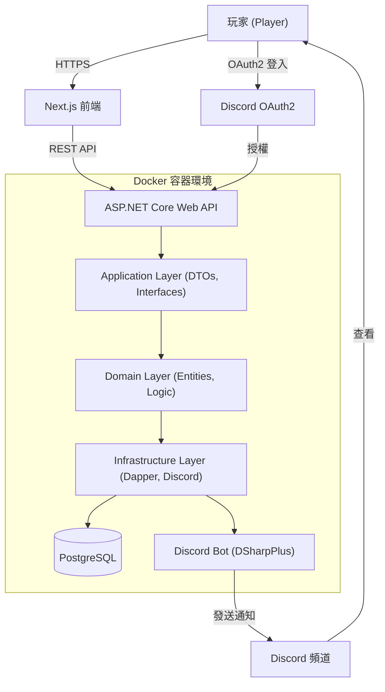
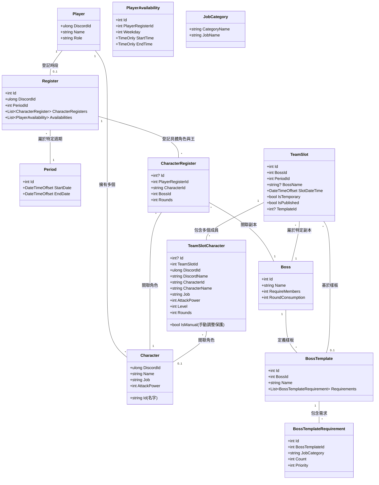
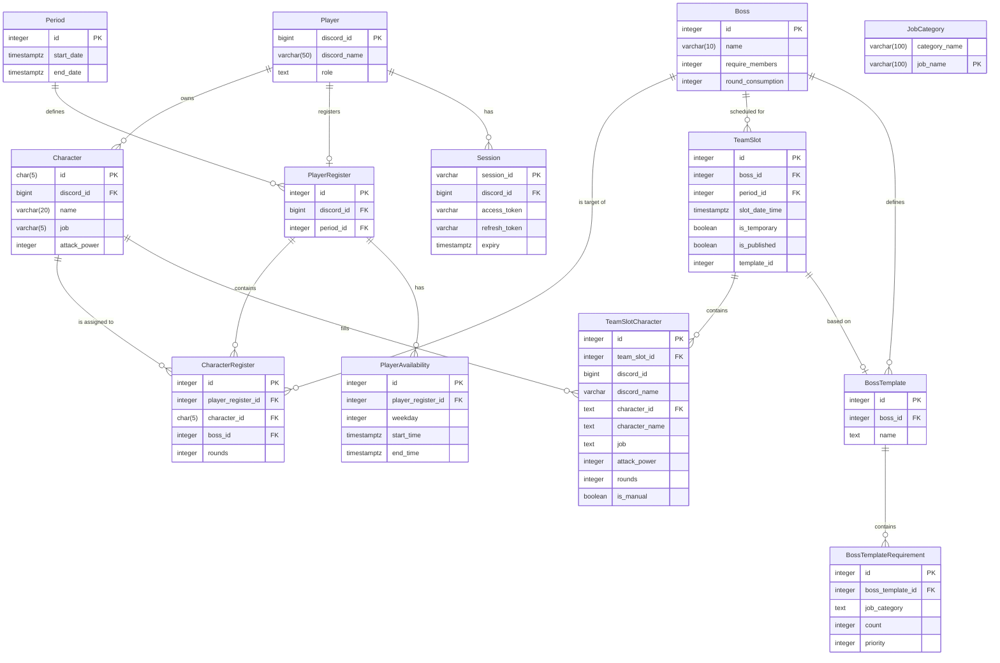

# System Design - MapleStoryRaidScheduler

本文件展示專案整體架構、API 流程、資料庫設計與部署方式，方便快速了解系統設計思路。

---

## 架構圖 (System Architecture)

### 高階系統架構

## 領域設計 (Domain Design)

本系統的核心業務邏輯圍繞在「角色管理」、「副本登記」以及「自動/手動排程」上。

### 核心實體 (Core Entities)

## 資料庫設計 (Database Design)

使用 PostgreSQL 作為資料儲存，並透過 Dapper 進行輕量級 ORM 操作。

### 實體關係圖 (ERD)

## Discord 整合 (Discord Integration)

系統深度整合 Discord，用於身分驗證與通知。

### 1. 認證流程 (OAuth2)
- 玩家點擊前端「Discord 登入」。
- 跳轉至 Discord 授權頁面，取得 `code`。
- 後端 `DiscordOAuthClient` 將 `code` 兌換為 `access_token` 與 `refresh_token`。
- 系統根據玩家在 Discord 伺服器中的**身分組 (Roles)** 判斷角色：
    - **管理員 (Admin)**: 建立 `Session` 紀錄並核發 `SessionId` 作為登入憑證。
    - **一般玩家 (User)**: 根據 Discord ID 識別玩家，並核發自定義 **JWT Token**。

### 2. Discord Bot 功能 (System Functions)
- **核心庫**: 使用 **DSharpPlus** 函式庫實作背景服務 (`DiscordBotService`)。
- **通知功能**: 
    - **每日提醒**: 每天自動提醒玩家當日的 Boss 行程。
    - **截止提醒**: 報名截止當天提醒玩家，並附上結果連結。
- **身分組同步 (Identity Sync)**: 
    - 雖然非由 DSharpPlus 客戶端處理，但系統透過 `DiscordOAuthClient` 使用 **Bot Token** 直接調用 Discord REST API (`/guilds/{GuildId}/members/{DiscordId}`)，在登入時檢查玩家的身分組以進行權限控管 (`Admin` 或 `User`)。

## 系統流程 (Request Flow)

### 1. 認證與登入 (Authentication)
1. **玩家**: 在前端點擊「Discord 登入」。
2. **Discord**: 玩家在授權頁面授權後，重新導向至前端並帶入 `code`。
3. **API**: 前端發送 `code` 到 `/api/Auth/Login`。
4. **Application Layer**: `AuthAppService` 呼叫 `DiscordOAuthClient` 取得 Token 與玩家資訊，並同步 Discord 身分組判斷角色。
5. **Domain/Infrastructure**: 
   - 檢查並建立 `Player` 實體。
   - **分流處理**:
     - **Admin**: 呼叫 `CreateSessionAsync` 建立 `Session` 紀錄，回傳 `SessionId`。
     - **User**: 呼叫 `CreateJwt` 核發自定義 JWT Token。
6. **前端**: 根據回傳的 `SessionId` 或 `JwtToken` 儲存憑證，並顯示對應的管理或玩家介面。

### 2. Raid 登記 (Registration)
1. **玩家**: 在前端選擇參與週期的 Boss、對應的角色與剩餘次數，並設定可用時段。
2. **API**: 發送 `POST /api/Register`。
3. **Infrastructure Layer**: `RegisterService` 使用 `UnitOfWork` 處理事務。
   - 更新或建立 `PlayerRegister`。
   - 清除並重新建立 `CharacterRegister` 與 `PlayerAvailability`。
4. **自動排程觸發**: 報名成功後，系統會立即針對該玩家的登記資訊調用 `TeamSlotService.AutoAssignAsync`。
   - 尋找該週期符合玩家可用時段且有空位的現成隊伍草稿。
   - 若有符合條件的現成隊伍草稿，優先加入成員；若無合適隊伍，則建立新的隊伍。這使得系統在報名階段就已初步完成排位，不完全依賴管理員發布排程。

### 3. 自動排程 (Auto Scheduling)
1. **即時自動排位 (Real-time Assignment)**: 玩家報名後立即觸發。系統會根據玩家可用時段，嘗試將角色分配至「已存在但未滿員」的隊伍。這降低了管理員發布前的操作工作量。
2. **手動/批次觸發 (Batch Scheduling)**: 管理員可在後台點擊「一鍵自動排程」對所有報名資料進行全局優化、合併與重排。
3. **Infrastructure Layer**: `TeamSlotService.AutoAssignAsync` 執行核心邏輯：
   - 獲取目前週期的所有登記資料。
   - **適配隊伍**: 尋找符合玩家時段且未滿員的現有 `TeamSlot`。
   - **建立新隊伍**: 若無匹配隊伍，則建立新 `TeamSlot` (IsPublished = false)，並根據玩家最優時段設定隊伍時間。
   - **合併隊伍**: 針對零散的隊伍進行 `MergeTeams`，根據樣板 (Template) 優化陣容，並嘗試尋找所有成員的共同可用時間。
4. **結果**: 生成或更新排班草稿，供管理員微調。

### 4. 補位與手動微調 (Fills & Adjustments)
1. **發布**: 管理員將 `TeamSlot.IsPublished` 設為 `true`。
2. **補位 (Fills)**: 玩家可於前端查看已發布的隊伍，前端會比對 `TeamSlot` 關聯的 `BossTemplate` 需求與目前的 `TeamSlotCharacter` 列表，動態顯示缺少的職業類別位子。
3. **手動更新**: 玩家點擊空位進行補位，發送 `PUT /api/TeamSlot` 呼叫 `TeamSlotService.UpdateAsync` 新增成員。
   - 系統驗證玩家只能操作自己的角色，除非是管理員。
   - 更新 `TeamSlotCharacter` 的 `IsManual = true`，**此旗標確保後續執行「一鍵自動排程」或「合併隊伍」時，系統會保護該成員及其所在的隊伍，不被自動重排邏輯覆蓋或拆散**。
4. **取消報名**: 玩家移除自己的角色位，系統將該位刪除。

### 5. 通知系統 (Notification)
1. **每日提醒 (Daily Reminder)**:
   - 背景作業 (Background Job) 每天定時掃描當日的 `TeamSlot`。
   - 針對有安排行程的玩家，Bot 會在頻道標記提醒當日時段。
2. **截止提醒 (Deadline Reminder)**:
   - 在報名截止日當天，系統自動觸發提醒。
   - Bot 發送訊息至頻道，提醒玩家報名已截止，並附上排團結果的 URL。
3. **Infrastructure Layer**: Discord Bot 透過 **DSharpPlus** 實作。
4. **玩家**: 在 Discord 收到通知並查看最新排程。

