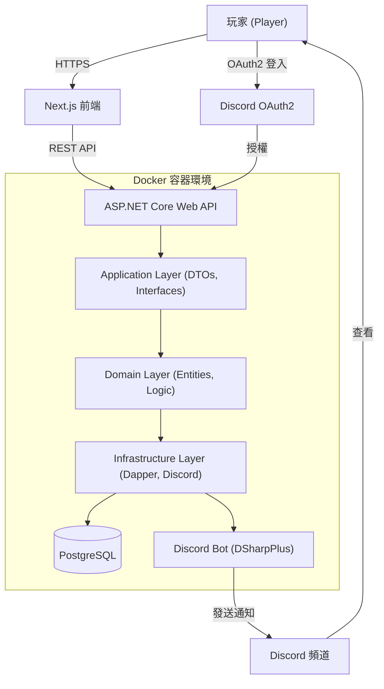
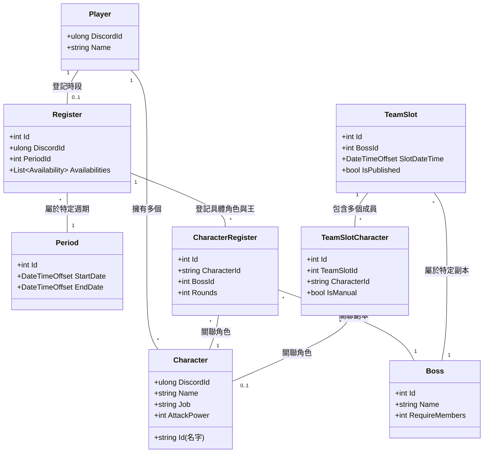
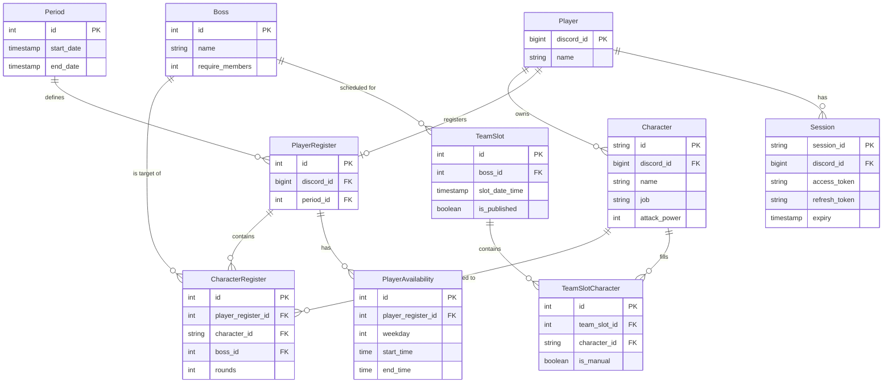

# System Design - MapleStoryRaidScheduler

本文件展示專案整體架構、API 流程、資料庫設計與部署方式，方便快速了解系統設計思路。

---

## 架構圖 (System Architecture)

### 高階系統架構

## 領域設計 (Domain Design)

本系統的核心業務邏輯圍繞在「角色管理」、「副本登記」以及「自動/手動排程」上。

### 核心實體 (Core Entities)

## 資料庫設計 (Database Design)

使用 PostgreSQL 作為資料儲存，並透過 Dapper 進行輕量級 ORM 操作。

### 實體關係圖 (ERD)

## Discord 整合 (Discord Integration)

系統深度整合 Discord，用於身分驗證與通知。

### 1. 認證流程 (OAuth2)
- 玩家點擊前端「Discord 登入」。
- 跳轉至 Discord 授權頁面，取得 `code`。
- 後端 `DiscordOAuthClient` 將 `code` 兌換為 `access_token` 與 `refresh_token`。
- 系統根據 Discord ID 識別玩家，並核發自定義 JWT Token。

### 2. Discord Bot
- 使用 **DSharpPlus** 函式庫。
- **通知功能**: 當管理員發布排班表或有重要變動時，Bot 會在指定頻道發送通知。
- **身分組同步**: 透過 Bot Token 調用 Discord API (`GetUserRolesAsync`)，檢查玩家在伺服器中的身分組，以進行權限控管。

## 系統流程 (Request Flow)

### 1. 建立 Raid 登記
1. **前端**: 使用者選擇登記的王、時段與角色。
2. **API**: 發送 `POST /api/Register` 請求。
3. **Application Layer**: 驗證資料格式，將 DTO 轉換為 Domain Entity。
4. **Domain Layer**: 檢查時間衝突、重複登記等業務邏輯。
5. **Infrastructure Layer**: 
   - 透過 `UnitOfWork` 開啟事務。
   - 使用 Dapper 將資料寫入 `PlayerRegister`、`CharacterRegister` 與 `PlayerAvailability` 表。
   - 提交事務。
6. **回傳**: 回傳成功結果，前端更新狀態。

### 2. 自動排程 (Auto Scheduling)
1. **管理員**: 在前端點擊「自動排程」。
2. **API**: 發送 `POST /api/Schedule/Auto` 請求。
3. **Application Layer**: 呼叫 `IScheduleService`。
4. **Domain Layer**: 
   - 獲取目前週期的所有登記資料。
   - 根據演算法（考慮玩家時段、角色強度、副本需求）生成 `TeamSlot` 與 `TeamSlotCharacter`。
5. **Infrastructure Layer**: 儲存生成的排班草稿（`IsPublished = false`）。
6. **管理員**: 審核並微調後，點擊「發佈」。

### 3. 通知系統
- 當管理員發布排班表或有重要變動時，`IDiscordService` 會被調用。
- Discord Bot 在指定頻道發送 Embed 訊息通知相關玩家。

