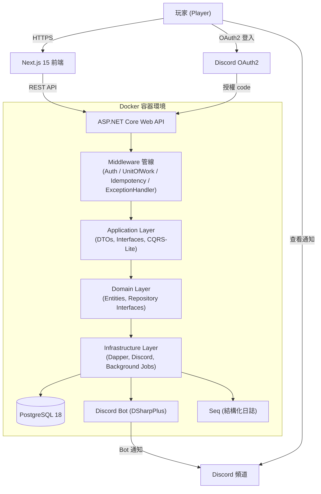
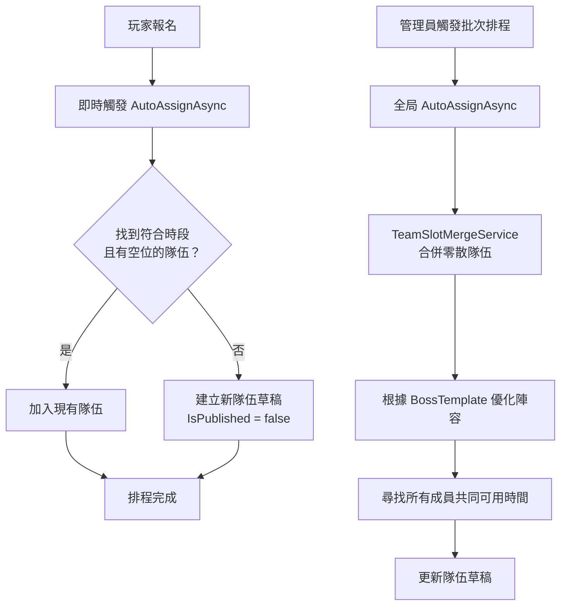
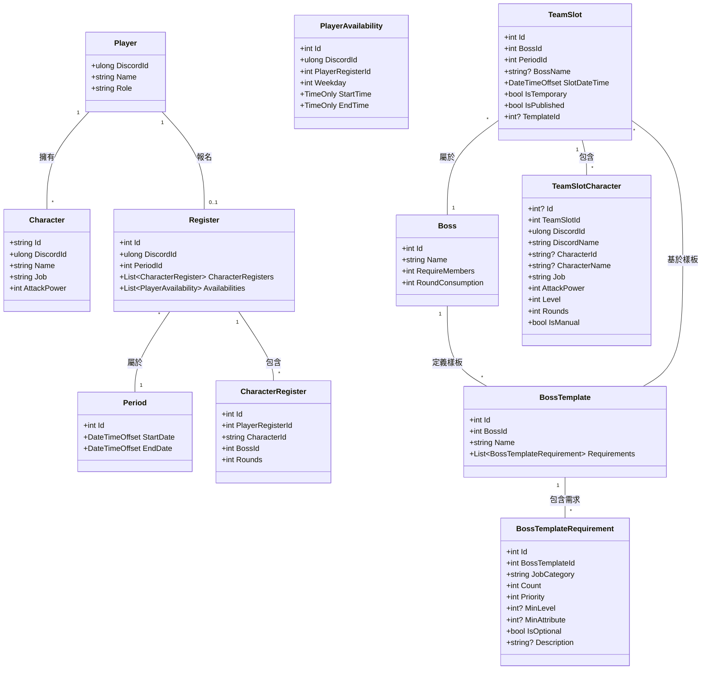
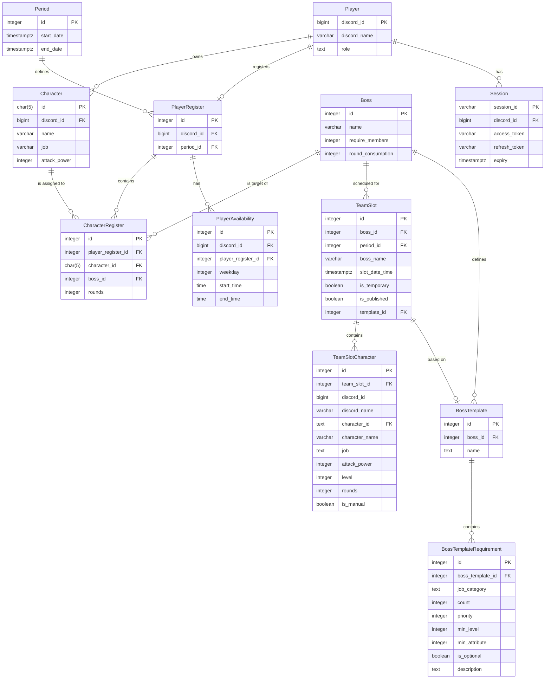
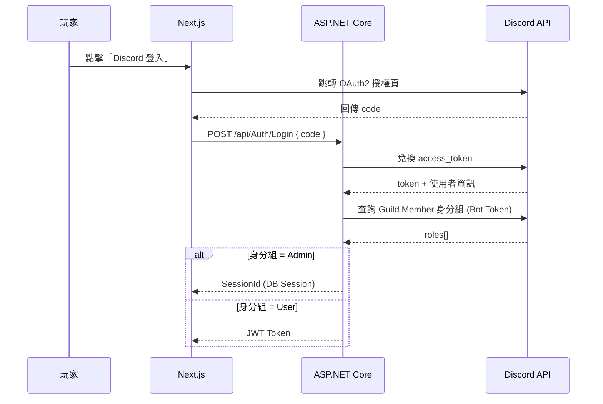

# 架構設計文件 — MapleStory Raid Scheduler

本文件說明系統的整體架構、關鍵設計決策與實作細節，適合快速了解系統設計思路。

---

## 系統架構總覽

### 高階架構圖



### 分層架構與依賴方向

```
Presentation.WebApi  →  Application  →  Domain
                              ↓
                       Infrastructure
```

| 層級 | 職責 | 設計原則 |
|---|---|---|
| **Domain** | 核心實體、Repository 介面、業務規則 | 零外部依賴，可獨立單元測試 |
| **Application** | DTOs、服務介面、查詢介面 | 定義業務邊界，不含實作細節 |
| **Infrastructure** | Dapper Repository、Discord 整合、背景作業 | 實作所有 I/O，依賴注入替換 |
| **Presentation.WebApi** | Controller、Middleware 管線 | 薄控制器，業務邏輯不在此層 |

---

## 關鍵設計決策

### 1. 不使用 EF Core，改用 Dapper + 自製 SqlBuilder

**決策原因**：EF Core 的 LINQ 翻譯在複雜查詢（多層 JOIN、CTE、條件動態組合）下難以預測生成的 SQL，且效能調優困難。

**實作方式**：自製 `Utils/SqlBuilder/`，以 C# Expression Tree 解析 Lambda 表達式為 SQL 條件：

```csharp
// 型別安全，編譯期檢查欄位名稱
Sql.Query<CharacterDbModel>()
   .Where(c => c.DiscordId == discordId && c.Job != null)
   .Select(c => new { c.Id, c.Name, c.Job })
   .Build();
```

| 類別 | 功能 |
|---|---|
| `QueryBuilder` / `TypedQueryBuilder` | SELECT 查詢，支援 Lambda 選欄 |
| `InsertBuilder` / `UpdateBuilder` / `DeleteBuilder` | 寫入操作 |
| `CteBuilder` | CTE（WITH 子句）建構 |
| `SqlConditionGroup` | AND/OR 條件群組組合 |
| `SqlExpressionVisitor` | 解析 Lambda 為 SQL，支援 NULL 比較 |

### 2. CQRS-Lite 讀寫分離

**決策原因**：讀取與寫入的需求差異大——寫入需要事務保護與業務驗證，讀取需要最佳化 SQL 與多表 JOIN。混用同一 Repository 會導致讀取路徑被事務拖慢。

**實作方式**：
- **寫入 (Command)**：`Application/Interface/` 定義介面 → `Infrastructure/Services/` 實作，走 `UnitOfWork` 事務。
- **讀取 (Query)**：`Application/Queries/` 定義介面 → `Infrastructure/Query/` 實作，直接執行最佳化 SQL，不走事務。

### 3. 雙軌身分驗證（JWT + Session）

**決策原因**：一般玩家數量多且無狀態需求，適合 JWT；管理員需要強制登出能力（撤銷 Session），不適合純 JWT。

**實作方式**：
- **玩家**：Discord OAuth2 → 核發自定義 JWT（含 DiscordId、Role）。
- **管理員**：Discord OAuth2 → 建立 DB Session 紀錄，核發 `SessionId`。
- 同一 `AuthenticationMiddleware` 依 Header 格式自動判斷驗證路徑。

### 4. 冪等性 Middleware

**決策原因**：前端在網路不穩時可能重試請求，若無冪等保護會造成重複報名、重複建立隊伍等問題。

**實作方式**：所有 POST/PUT/DELETE 請求必須帶 `X-Idempotency-Key`，`IdempotencyMiddleware` 以此 Key 為快取鍵，相同 Key 的重複請求直接回傳快取結果，不重新執行業務邏輯。

---

## Middleware 管線

請求進入後依序經過：

```
Request
  │
  ▼
ExceptionHandlerMiddleware   ← 全域例外捕捉，統一回傳 ProblemDetails
  │
  ▼
IdempotencyMiddleware        ← 強制 X-Idempotency-Key，防重複操作
  │
  ▼
AuthenticationMiddleware     ← 驗證 JWT（玩家）或 SessionId（管理員）
  │
  ▼
UnitOfWorkMiddleware         ← 開啟 DB 事務，成功 Commit，例外 Rollback
  │
  ▼
Controller / Service
```

---

## 自動排程引擎

這是系統最核心的業務邏輯，分為三個階段：

### 流程圖



### 補位保護機制

發布後的隊伍允許玩家手動補位，補位成員標記 `IsManual = true`。批次排程執行時會跳過含有 `IsManual` 成員的隊伍，確保人工調整不被覆蓋。

---

## 領域模型



---

## 資料庫設計 (ERD)

使用 PostgreSQL 18，Dapper 手寫 SQL，無 ORM 自動 Migration。



---

## Discord 整合

### OAuth2 認證流程



### Discord Bot 功能

| 功能 | 說明 |
|---|---|
| **每日提醒** | 背景作業每天掃描當日 `TeamSlot`，Bot 標記玩家提醒行程 |
| **截止提醒** | 報名截止日自動觸發，附上排程結果 URL |
| **身分組同步** | 登入時透過 Bot Token 查詢 Discord Guild Member，判斷 `Admin` / `User` |

---

## 主要服務一覽

| 服務 | 職責 |
|---|---|
| `RegisterService` | 玩家報名寫入，報名後觸發即時自動排程 |
| `TeamSlotAutoAssignService` | 自動排程核心：即時分配 + 批次排程 |
| `TeamSlotMergeService` | 合併零散隊伍，根據 BossTemplate 優化陣容 |
| `TeamSlotCharacterService` | 補位、移除成員，設定 `IsManual` 保護旗標 |
| `AuthAppService` | Discord OAuth2 流程、角色判斷、憑證核發 |
| `JwtService` / `SessionService` | JWT 核發驗證 / DB Session 管理 |
| `DiscordOAuthClient` | Discord REST API 呼叫（token 兌換、身分組查詢） |
| `ScheduleService` | 背景作業協調（每日提醒、截止提醒） |
