# 架構設計文件 — MapleStory Raid Scheduler

本文件說明系統的整體架構、關鍵設計決策與實作細節，適合快速了解系統設計思路。

---

## 系統架構總覽

### 高階架構圖

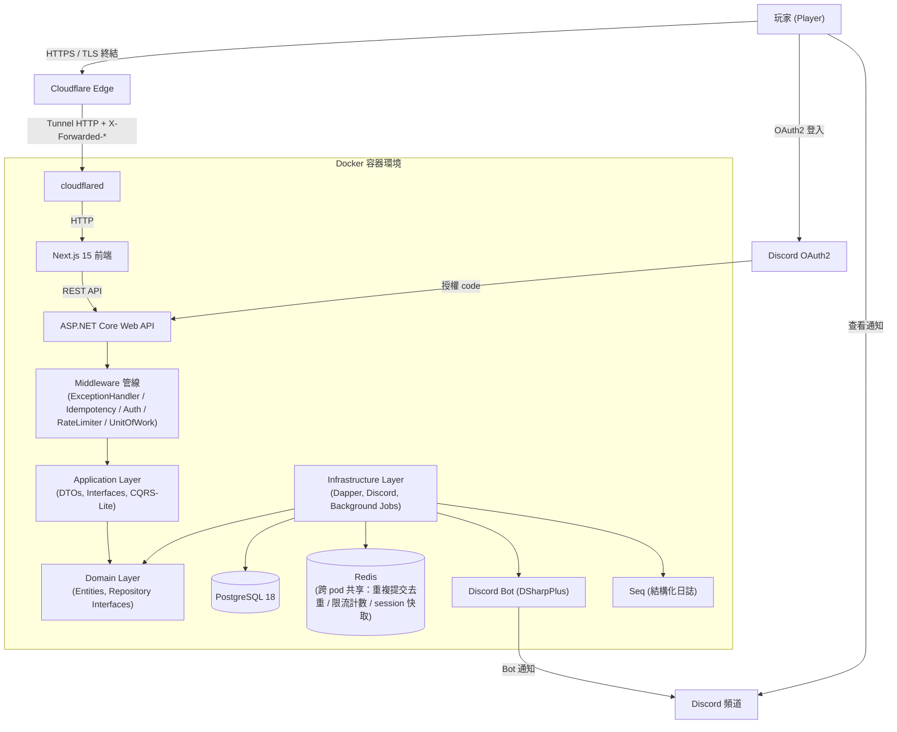
```mermaid
graph TD
    User["玩家 (Player)"] -->|HTTPS / TLS 終結| Cloudflare["Cloudflare Edge"]
    Cloudflare -->|Tunnel HTTP + X-Forwarded-*| Cloudflared["cloudflared"]

    subgraph "Docker 容器環境"
        Cloudflared -->|HTTP| Frontend["Next.js 15 前端"]
        Frontend -->|REST API| Backend["ASP.NET Core Web API"]
        Backend --> Middleware["Middleware 管線\n(ExceptionHandler / Idempotency / Auth / RateLimiter / UnitOfWork)"]
        Middleware --> Application["Application Layer\n(DTOs, Interfaces, CQRS-Lite)"]
        Application --> Domain["Domain Layer\n(Entities, Repository Interfaces)"]
        Infrastructure["Infrastructure Layer\n(Dapper, Discord, Background Jobs)"] --> Domain

        Infrastructure --> DB[("PostgreSQL 18")]
        Infrastructure --> Redis[("Redis\n(跨 pod 共享：重複提交去重 / 限流計數 / session 快取)")]
        Infrastructure --> DiscordBot["Discord Bot (DSharpPlus)"]
        Infrastructure --> Seq["Seq (結構化日誌)"]
    end

    DiscordBot -->|Bot 通知| DiscordChannel["Discord 頻道"]
    User -->|查看通知| DiscordChannel
    User -->|OAuth2 登入| DiscordOAuth["Discord OAuth2"]
    DiscordOAuth -->|授權 code| Backend
```

### 分層架構與依賴方向

```
Presentation.WebApi  →  Application  →  Domain
                              ↓
                       Infrastructure
```

| 層級 | 職責 | 設計原則 |
|---|---|---|
| **Domain** | 核心實體、Repository 介面、業務規則 | 零外部依賴，可獨立單元測試 |
| **Application** | DTOs、服務介面、查詢介面 | 定義業務邊界，不含實作細節 |
| **Infrastructure** | Dapper Repository、Discord 整合、背景作業 | 實作所有 I/O，依賴注入替換 |
| **Presentation.WebApi** | Controller、Middleware 管線 | 薄控制器，業務邏輯不在此層 |

---

## 關鍵設計決策

### 1. 不使用 EF Core（Runtime），改用 Dapper + 自製 SqlBuilder

**決策原因**：Runtime 刻意不用 EF Core，改用 Dapper——目的是練習無模型（model-less）的資料存取方式，不是規模考量（EF Core 對此規模其實更省事）。手寫 SQL 的字串散落問題，用自製 SqlBuilder（Expression Tree 解析 Lambda 產生型別安全 SQL）解決。

> **注意**：`Infrastructure/Migrations/MigrationDbContext` 僅供 design-time 使用（詳見第 6 點），不注冊到 DI，不影響 runtime 行為。

**實作方式**：自製 `Utils/SqlBuilder/`，以 C# Expression Tree 解析 Lambda 表達式為 SQL 條件：

```csharp
// 型別安全，編譯期檢查欄位名稱
Sql.Query<CharacterDbModel>()
   .Where(c => c.DiscordId == discordId && c.Job != null)
   .Select(c => new { c.Id, c.Name, c.Job })
   .Build();
```

| 類別 | 功能 |
|---|---|
| `QueryBuilder` / `TypedQueryBuilder` | SELECT 查詢，支援 Lambda 選欄 |
| `InsertBuilder` / `UpdateBuilder` / `DeleteBuilder` | 寫入操作 |
| `CteBuilder` | CTE（WITH 子句）建構 |
| `SqlConditionGroup` | AND/OR 條件群組組合 |
| `SqlExpressionVisitor` | 解析 Lambda 為 SQL，支援 NULL 比較 |

### 2. CQRS-Lite 讀寫分離

**決策原因**：讀取與寫入的**模型不同**——寫入用 entity + `UnitOfWork` 事務保護與業務驗證，讀取需要跨表 JOIN 回**專用 DTO**、不受寫入模型約束。分開讓讀側能自由最佳化查詢。

> 這是 CQRS 的**核心原則**（讀寫責任分離），但本專案是**同一資料庫、強一致的輕量版（CQRS-Lite）**，非「獨立讀庫 + 物化視圖 + 事件溯源 + 最終一致」的完整型 CQRS。停在輕量版對此規模是刻意取捨。

**實作方式**：
- **寫入 (Command)**：`Application/Interface/` 定義介面 → `Infrastructure/Services/` 實作，走 `UnitOfWork` 事務。
- **讀取 (Query)**：`Application/Queries/` 定義介面 → `Infrastructure/Query/` 實作，直接執行 JOIN SQL，不走事務。

```
寫入路徑：Controller → IXxxService → IRepository → DB（UnitOfWork 包裹）
讀取路徑：Controller → IXxxQuery  → QueryBuilder → DB（無事務）
```

### 3. Unit of Work 模式

**決策原因**：一個 HTTP 請求可能涉及多個 Repository 操作，需保證原子性。

**實作方式**：`UnitOfWorkMiddleware` 在請求進入前開啟 `NpgsqlConnection` + `NpgsqlTransaction`，成功後 commit，例外時 rollback。所有 Repository 共享同一連線。

```csharp
// UnitOfWorkMiddleware.cs
await _unitOfWork.BeginTransactionAsync();
await next(context);
await _unitOfWork.CommitAsync();
```

**連線池 headroom**：目前 Npgsql `Maximum Pool Size`（預設 100）與 Postgres `max_connections`（預設 100）之間沒有預留 headroom。負載測試（`plans/2026-07-28-load-testing.md` Phase 1）確認：backend 自己的請求不會因此失敗——超過 pool 上限的請求在 client 端排隊等連線，只是變慢；真正會被拒絕的是**繞過這個 pool 的外部新連線**（`psql`、migration job 等直接連 Postgres 的操作），backend pool 佔滿 `max_connections` 額度時這些連線會直接收到 `FATAL: sorry, too many clients already`。連線閒置要等 `Connection Idle Lifetime`（預設 300 秒）才會被收回，短時間內連續操作容易疊加占用。正式環境部署前應為 Postgres `max_connections` 保留 headroom（backend pool + migrate + 其他服務 + 保留量 < max_connections），或明確設定 Npgsql `Maximum Pool Size` 上限／縮短 `Connection Idle Lifetime`。

### 4. 雙軌身分驗證

**決策原因**：一般玩家與管理員的驗證需求不同——玩家走 Discord OAuth2 取得 JWT（無狀態），管理員需要更嚴格的 Session 控管（可強制登出）。

**實作方式**：`AuthenticationMiddleware` 統一入口，依 Token 類型分流：

| 類型 | 機制 | 儲存位置 |
|---|---|---|
| 一般玩家 | 自定義 JWT | 客戶端 Cookie |
| 管理員 | SessionId | DB `session` 表 |

Discord 身分組 → 系統角色的對應由 `DiscordRoleMapping` 表管理，可動態調整。

**Session 快取（跨 pod 撤銷）**：管理員 session 讀取走快取，存 **Redis**（`ISessionCache` / `RedisSessionCache`）而非 per-pod `IMemoryCache`——所以 `DeleteAsync` / `DeleteByDiscordAsync` 撤銷（登出、拔身分組、踢人）**一次刪除即在所有 pod 立即生效**，不再是「只清當下 pod、其他 pod 等 TTL」。**讀**穿快取 miss 退回查 DB 自癒；Redis 不可用時 fail-open（退回查 DB，DB 為真實來源）。

> 上面「OAuth2 認證流程」那張圖只到**登入當下**（拿到 SessionId/JWT 為止；`SessionService.CreateAsync` 只寫 DB，不碰快取）。下圖補的是**登入之後、每次帶 SessionId 打 API** 的驗證流程，含跨行程撤銷——這段是 cache-aside + 跨行程失效，純文字條列比較難一眼看出時序，用圖比較清楚：

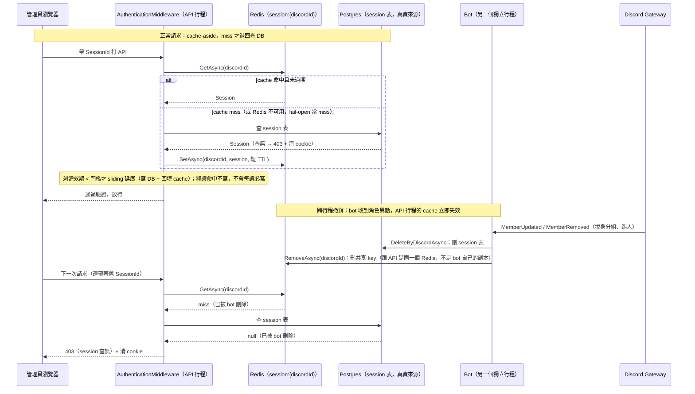
```mermaid
sequenceDiagram
    participant Admin as 管理員瀏覽器
    participant MW as AuthenticationMiddleware（API 行程）
    participant Cache as Redis（session:{discordId}）
    participant DB as Postgres（session 表，真實來源）
    participant Bot as Bot（另一個獨立行程）
    participant Discord as Discord Gateway

    Note over Admin,DB: 正常請求：cache-aside，miss 才退回查 DB
    Admin->>MW: 帶 SessionId 打 API
    MW->>Cache: GetAsync(discordId)
    alt cache 命中且未過期
        Cache-->>MW: Session
    else cache miss（或 Redis 不可用，fail-open 當 miss）
        MW->>DB: 查 session 表
        DB-->>MW: Session（查無 → 403 + 清 cookie）
        MW->>Cache: SetAsync(discordId, session, 短 TTL)
    end
    Note over MW: 剩餘效期 < 門檻才 sliding 延展（寫 DB + 回填 cache）；純讀命中不寫，不會每讀必寫
    MW-->>Admin: 通過驗證，放行

    Note over Bot,Cache: 跨行程撤銷：bot 收到角色異動，API 行程的 cache 立即失效
    Discord->>Bot: MemberUpdated / MemberRemoved（拔身分組、踢人）
    Bot->>DB: DeleteByDiscordAsync：刪 session 表
    Bot->>Cache: RemoveAsync(discordId)：刪共享 key（跟 API 是同一個 Redis，不是 bot 自己的副本）

    Admin->>MW: 下一次請求（還帶著舊 SessionId）
    MW->>Cache: GetAsync(discordId)
    Cache-->>MW: miss（已被 bot 刪除）
    MW->>DB: 查 session 表
    DB-->>MW: null（已被 bot 刪除）
    MW-->>Admin: 403（session 查無）+ 清 cookie
```

### 5. 重複提交防護（非完整冪等）

**決策原因**：前端連點或網路重送可能造成重複寫入（如重複申請、重複邀請）。

**實作方式**：POST/PUT/DELETE 必須帶合法 UUID 的 `X-Idempotency-Key`（缺少或非 UUID 回 400）；`IdempotencyMiddleware` 以此 Key 去重，同一 Key 在 60 秒內重送直接回 **409 Conflict**、不進入業務邏輯。去重狀態存 **Redis**（`SET NX EX`，跨 pod 共享；經 `IIdempotencyStore` 抽象）——取代原本 per-pod 的 `IMemoryCache`。Redis 不可用時採 **fail-open**（放行 + 記 log，不因去重快取抖動擋掉寫入；真正的重複由 leader-led 的唯一索引 `uq_tsc_active_membership`／`uq_tsc_confirmed_overlap` 兜底）。

> 注意：這是「擋重送」而非完整冪等——重試不會重播第一次的回應內容（只快取一個標記，非結果）。真冪等需快取並重播原始回應；此處刻意簡化為 de-dup，因寫入操作重送應由使用者感知（409）而非默默視為成功。

### 6. Schema 版本管理（golang-migrate）

**決策原因**：手寫 SQL 無 ORM migration 機制，多環境（dev / prod）的 schema 需要明確的版本追蹤與 rollback 能力，確保環境一致性與部署安全。

**實作方式**：`db/migrations/` 存放有序號的 up/down SQL 檔，migrate service 在 backend 啟動前執行。

```
db/migrations/
  000001_init_schema.up.sql    ← 建立全部資料表與索引
  000001_init_schema.down.sql  ← DROP 全部資料表（反向 FK 順序）
  000002_xxx.up.sql            ← 後續 schema 變更
  000002_xxx.down.sql
```

**新增 Migration 工作流程**：

```bash
# 1. 修改 Infrastructure/Entities/*DbModel.cs

# 2. 執行草稿產生器（自動完成 ef diff → SQL 輸出 → 清理 .cs）
bash db/create-migration.sh <MigrationName>

# 3. 審閱並補齊產出的 SQL 草稿：
#    db/migrations/000002_<name>.up.sql   ← 補 FK constraints / indexes
#    db/migrations/000002_<name>.down.sql ← 確認 rollback 正確性
```

`db/create-migration.sh` 流程說明（Zero DB、Zero State File）：
- `ef migrations add <Name>` → rebuild 專案、產生 C# diff、更新 Snapshot
- `ef migrations script 0 <new>` → up SQL 草稿
- `ef migrations script <new> 0` → down SQL 草稿
- 過濾 `__EFMigrationsHistory`、`START TRANSACTION`、`COMMIT`
- 刪除 .cs migration 檔（保留 Snapshot 作為下次 diff 基線）

> **為何 `from=0` 可行**：`ef migrations add` 強制 rebuild，新 DLL 只含剛加入的 migration（舊 .cs 已刪），`script 0 NewMig` 因此只產生該次的增量 SQL。此行為依賴 assembly-based（非 file-based）的 migration 掃描機制。

> **版本鎖定要求**：EF Core 的 SQL 生成行為依賴具體版本。升版前需重新驗證 script 輸出。目前鎖定版本：`Npgsql.EntityFrameworkCore.PostgreSQL 9.0.4`、`Microsoft.EntityFrameworkCore.Design 9.0.4`。

Migration image 以 `db/Dockerfile.migrate` 自製（golang-migrate 基底 + SQL 烤入），新增 migration 只需 rebuild image，k8s YAML 不需改動。

**Rollback 策略**：

| 情境 | 做法 |
|---|---|
| 本機開發 reset | `migrate down 1` → `migrate up` |
| Production 出問題 | PostgreSQL PITR / DB snapshot restore |
| Schema 寫錯 | 補一版 forward fix migration（`000003_fix_xxx.up.sql`） |

`down.sql` 是開發工具，不是 production rollback 機制。Production rollback 依賴 infrastructure 層（DB snapshot），而非應用層 migration。

### 7. 設定變更的可靠投遞（Transactional Outbox）

**決策原因**：跨行程的可靠事件投遞有兩個用途——(1) 設定變更（`ConfigChanged`）要喚醒 bot 端背景 job 重讀；(2) leader-led 組隊狀態改動（`TeamNotification`）要由 bot 發 Discord DM。原本用 `DbContext.AfterCommit`（in-process post-commit hook）有兩個問題：commit 後、跑動作前 crash 會**遺失**；且事件在 **API** 產生、消費者在 **bot**，in-process 事件**跨不了行程**（API 的 notifier 無訂閱者 = no-op）。

**實作方式**：改用 transactional outbox（`OutboxMessage` 表）。

| 端 | 元件 | 做法 |
|---|---|---|
| 寫入 | `IOutbox` / `Outbox` | 用**當前 UoW 的交易** INSERT outbox 列 → 與業務資料**原子提交/rollback**（無鬼影事件） |
| 派發 | `OutboxDispatcher`（跑 bot、自開專屬連線） | 輪詢已提交列 → 依 `Type` 派 `IOutboxHandler` → 標 `ProcessedAt` |

寫入端（API）跟派發端（bot）是**兩個獨立行程**，中間沒有直接呼叫，只靠共享 DB 的已提交列銜接——下圖同時畫出正常路徑，跟「handler 執行完、commit 前中斷」的 crash 重送路徑（`OutboxIntegrationTests.CrashBeforeCommit_...` 實測過的情境，不是只推論）：

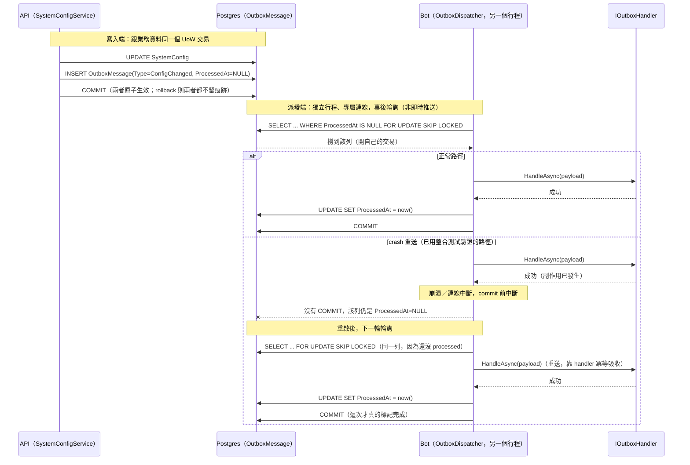
```mermaid
sequenceDiagram
    participant API as API（SystemConfigService）
    participant DB as Postgres（OutboxMessage）
    participant Bot as Bot（OutboxDispatcher，另一個行程）
    participant H as IOutboxHandler

    Note over API,DB: 寫入端：跟業務資料同一個 UoW 交易
    API->>DB: UPDATE SystemConfig
    API->>DB: INSERT OutboxMessage(Type=ConfigChanged, ProcessedAt=NULL)
    API->>DB: COMMIT（兩者原子生效；rollback 則兩者都不留痕跡）

    Note over Bot,DB: 派發端：獨立行程、專屬連線，事後輪詢（非即時推送）
    Bot->>DB: SELECT ... WHERE ProcessedAt IS NULL FOR UPDATE SKIP LOCKED
    DB-->>Bot: 撈到該列（開自己的交易）

    alt 正常路徑
        Bot->>H: HandleAsync(payload)
        H-->>Bot: 成功
        Bot->>DB: UPDATE SET ProcessedAt = now()
        Bot->>DB: COMMIT
    else crash 重送（已用整合測試驗證的路徑）
        Bot->>H: HandleAsync(payload)
        H-->>Bot: 成功（副作用已發生）
        Note over Bot: 崩潰／連線中斷，commit 前中斷
        Bot--xDB: 沒有 COMMIT，該列仍是 ProcessedAt=NULL
        Note over Bot,DB: 重啟後，下一輪輪詢
        Bot->>DB: SELECT ... FOR UPDATE SKIP LOCKED（同一列，因為還沒 processed）
        Bot->>H: HandleAsync(payload)（重送，靠 handler 冪等吸收）
        H-->>Bot: 成功
        Bot->>DB: UPDATE SET ProcessedAt = now()
        Bot->>DB: COMMIT（這次才真的標記完成）
    end
```

- **多 pod 分工**：`SELECT ... FOR UPDATE SKIP LOCKED` → 多個 dispatcher 各撈不相交批、互不重投、免選 leader。
- **at-least-once + 冪等**：投遞成功、標 processed 前崩 → 重送；靠 handler 冪等（`ConfigChanged` 只是喚醒 job 重讀）吸收。
- partial index（`WHERE "ProcessedAt" IS NULL`）撈取快；重試上限後放棄、記 `LastError`。
- **保留列清理**：`OutboxDispatcher` 只標 `ProcessedAt`、從不刪列，`OutboxMessage` 會無限成長。`OutboxRetentionJob`（同樣跑 bot、自開專屬連線）每 24 小時清一次「已處理超過 30 天」的列；未處理列不管多舊都不動（還沒投遞完，刪了就真的遺失事件）。

> outbox 把「要送什麼」持久化進交易 → 解掉 AfterCommit 的 crash-loss 與跨行程限制。定位為 readiness（現況 replicas=1、副作用可補），但順帶修掉跨行程 gap。

---

### 8. 可觀測性（日誌 + 錯誤追蹤 + 送第三方前的隱私保護）

日誌走 **Serilog**，兩個 sink 並存、職責分開（`Presentation.WebApi/Program.cs` 的 `UseSerilog`；bot 端 `Presentation/Program.cs` 同套）：

- **Seq（內部結構化日誌）**：`.WriteTo.Seq(Seq:ServerUrl)`，收全部 log，內部除錯用，明碼保留（Seq 是內網服務）。
- **Sentry（錯誤追蹤）**：`.WriteTo.Sentry(...)`，**只在 `Sentry:Dsn` 有設定且 `IsProduction()` 時才掛**（本機開發/沒設 DSN 就不掛，缺設定不噴例外）。

**送到第三方（Sentry）前的隱私保護**——因為 Sentry 是外部服務，`SetBeforeSend` 統一在單一關卡把敏感資料擋掉，不必逐一改每個 log 呼叫點：

- **DiscordId → HMAC-SHA256**：DiscordId 是間接識別個人的資料，不明碼送出。有設 `Sentry:DiscordIdHashKey` 就雜湊成 `discord_id_hash` tag（HMAC 而非純 SHA256——snowflake 非高熵，純 SHA256 可列舉反推，HMAC 沒密鑰連候選值都算不出）；沒設密鑰就不送這個 tag。無論如何原本的 `Extra["DiscordId"]` 明碼一律換成 `[Filtered]`。
- **`ScrubSensitive` 掃三個獨立欄位**：例外訊息（`SentryExceptions[].Value`，如 Npgsql 連線失敗會夾連線字串）、渲染後的 log 訊息（`Message.Formatted`）、breadcrumb 訊息——三者是分開的欄位，只掃一個會漏。pattern 見 `Program.cs` 的 `ScrubSensitive`（密碼、JWT、OAuth token 等）。
- **breadcrumb 門檻**：`MinimumBreadcrumbLevel = Warning`。

> 相關 secret（皆選填，`optional: true`）：`sentry_dsn`（沒設就不掛 Sentry）、`discord_hash_key`（沒設就不送 DiscordId 雜湊 tag）。設計沿革見 `plans/2026-08-03-bugsink-integration.md`、`plans/2026-08-04-sentry-discordid-hmac.md`。

---

## Middleware 管線

請求進入後依序經過：

```
Request
  │
  ▼
ExceptionHandlerMiddleware   ← 全域例外捕捉，統一回傳 ProblemDetails
  │
  ▼
IdempotencyMiddleware        ← 強制 X-Idempotency-Key（否則 400），重送回 409 擋重複提交
  │
  ▼
AuthenticationMiddleware     ← 驗證 JWT（玩家）或 SessionId（管理員），設 discordId claim
  │
  ▼
RateLimiter                  ← 登入後按 discordId 限流（100/10s/人，計數存 Redis 固定視窗故跨 pod 共用上限；Redis 掛則 fail-open 放行）；放此處故被擋的請求不白開 DB 交易
  │
  ▼
UnitOfWorkMiddleware         ← 開啟 DB 事務，成功 Commit，例外 Rollback
  │
  ▼
Controller / Service
```

> **限流為何按身分不按 IP**：`discordId` 來自已驗證的 session/JWT，client 偽造不了，換 IP 也繞不掉；且前端 proxy 會剝除 `X-Forwarded-For`／`cf-connecting-ip`，後端本就看不到真實 IP。未登入端點（登入前暴力破解）不在此限——那需 IP／CAPTCHA／帳號鎖定，屬另案。

> **健康檢查端點例外**：`/health/live`、`/health/ready` 以 `UseHealthChecks` **終端中介軟體**掛在這條管線**之前**，完全繞過後面所有中介軟體。
> 原因：探針不該需要認證、也不該開交易；readiness 的 DB 檢查走專屬 `DatabaseHealthCheck`（不經請求管線）→ DB 掛掉乾淨回 503，liveness 不查 DB 故不誤殺 pod。詳見 `docs/cd-deploy-setup.md`。

### 請求生命週期（交易邊界）

上面是「管線順序」；下圖是「一個請求的時間流」，重點在 **UnitOfWork 的交易邊界**與 **Dapper 沿用同一連線／交易**：

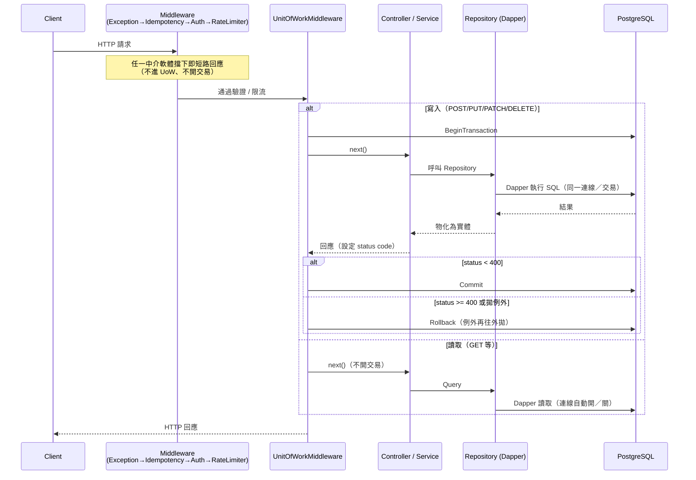
```mermaid
sequenceDiagram
    participant C as Client
    participant MW as Middleware<br/>(Exception→Idempotency→Auth→RateLimiter)
    participant UoW as UnitOfWorkMiddleware
    participant Ctrl as Controller / Service
    participant Repo as Repository (Dapper)
    participant DB as PostgreSQL

    C->>MW: HTTP 請求
    Note over MW: 任一中介軟體擋下即短路回應<br/>（不進 UoW、不開交易）
    MW->>UoW: 通過驗證 / 限流
    alt 寫入（POST/PUT/PATCH/DELETE）
        UoW->>DB: BeginTransaction
        UoW->>Ctrl: next()
        Ctrl->>Repo: 呼叫 Repository
        Repo->>DB: Dapper 執行 SQL（同一連線／交易）
        DB-->>Repo: 結果
        Repo-->>Ctrl: 物化為實體
        Ctrl-->>UoW: 回應（設定 status code）
        alt status < 400
            UoW->>DB: Commit
        else status >= 400 或拋例外
            UoW->>DB: Rollback（例外再往外拋）
        end
    else 讀取（GET 等）
        UoW->>Ctrl: next()（不開交易）
        Ctrl->>Repo: Query
        Repo->>DB: Dapper 讀取（連線自動開／關）
    end
    UoW-->>C: HTTP 回應
```

> 交易邊界由中介軟體統一掌控，**Controller／Repository 不碰交易生命週期**——這是 Unit of Work 的核心：一個請求一個交易，成功才 Commit，任何失敗（4xx 或例外）整批 Rollback。詳見上方「關鍵設計決策 §3」。

---

## Leader-led 組隊引擎

系統核心是 **leader-led（隊長主導）+ period-less（即時／排程）** 的組隊流程——任何登入者開隊、設需求，靠 **Pull（隊長挑候選邀請）** 與 **Push（玩家申請、隊長審核）** 兩個方向把人湊齊。舊的「玩家報名 → 系統自動排團 + 範本批次重排 + 補位」引擎（`RegisterService`／`TeamSlotAutoAssignService`／`TeamSlotMergeService`／`ScheduleService`／`Period`／`BossTemplate`）已於 period-less 重構 Phase 4c/4d 整包退場（見 `plans/2026-08-12-period-less-phase4cd-cleanup.md`）。

### 狀態機

一筆 `TeamSlotCharacter` 的 `Status` 走這條路：

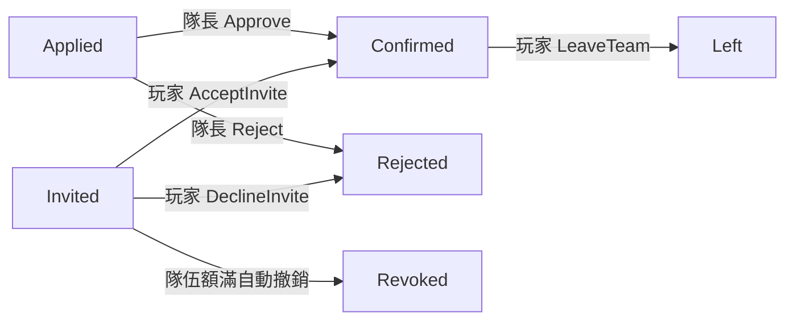
```mermaid
flowchart LR
    Invited -->|玩家 AcceptInvite| Confirmed
    Invited -->|玩家 DeclineInvite| Rejected
    Applied -->|隊長 Approve| Confirmed
    Applied -->|隊長 Reject| Rejected
    Confirmed -->|玩家 LeaveTeam| Left
    Invited -->|隊伍額滿自動撤銷| Revoked
```

- **Pull（`GetCandidatesAsync` → `InviteMemberAsync` → `AcceptInviteAsync`）**：隊長從候選清單挑人邀請（`Invited`），玩家接受成 `Confirmed`。
- **Push（`ApplyAsync` → `ApproveAsync`/`RejectAsync`）**：玩家用自己的角色申請（`Applied`），隊長審核。
- **入隊定案**（`AcceptInviteAsync`〔玩家接受〕與 `ApproveAsync`〔隊長核准〕共用 `ConfirmMemberAsync`）：見下「入隊定案的併發控制」。
- 其餘：`LeaveTeamAsync`（`Confirmed`→`Left`，釋放位子）、隊長轉讓（`ProposeLeaderTransferAsync` 設 `PendingLeaderDiscordId` → 對方 `RespondLeaderTransferAsync` accept/decline）。

### 開隊：Scheduled vs Instant

`CreateTeamAsync`（`Source = leader`）分兩種 `Kind`：

| Kind | 時間 | 候選來源 | 到期 |
|---|---|---|---|
| `Scheduled` | 約定的 `SlotDateTime`（**不得早於現在**——period-less 後不再解析／綁 `Period`，改驗時間本身合法） | 參戰中角色 × 常設可用時段 overlap 開團時間 | 無（`SlotDateTime` 過了自然失效） |
| `Instant` | 現在（`now`） | 玩家掛的找隊意圖 `LfgIntent`（隊長 pull 為候選、跳過時段比對；**非公開看板**） | `ExpiresAt = now + 3h` TTL |

開隊時附一組**需求列**（`TeamSlotRequirement`：`Count` + `MinClearCount` + `Jobs[{Job, MinAttackPower}]`；子表 `TeamSlotRequirementJob`）。需求只用來**過濾候選 + 前端招募告示**，不強制隊伍職業組成（容量只認 `Boss.RequireMembers`）。

### 候選過濾（Pull）

`GetCandidatesAsync`：

- **Scheduled**：候選池 = `IsSeekingRaid` 的角色 × 其玩家 `PlayerAvailabilityStanding`（常設可用時段）與開團時間 weekday+time 重疊；`PlayerAvailabilityOverride`（特定日期例外）蓋過常設。再依需求列過濾：職業符合、攻擊力 ≥ 門檻、**通關數**（`CharacterBossClear` 同玩家跨角色對該王加總）≥ `MinClearCount`。
- **Instant**：候選來自 `LfgIntent`（現在想打該王的人），略過時段比對。
- 兩者都做**狀態感知去重**：排除「其玩家已在本隊 active（`Confirmed`/`Invited`/`Applied`）」者，以及「已在該開團時刻別隊 `Confirmed`」者（對齊跨隊重疊約束，見下）。

### 招募缺口・隊員組成・顯示身分

- **招募缺口**（`GetRecruitmentGapAsync`）：對每條需求列數已 `Confirmed` 的同職業成員，`還缺 = Count − 已配`（**逐列貪婪**、限定職業列先配再配不限）；前端在候選/審核頁顯示「還缺 主教×1…」，並依需求職業分組、缺的排前。軟提示——不改容量、不強制組成。
- **隊員組成**（`GetTeamMembersAsync`）：已 `Confirmed` 成員或隊長可看該隊成員（角色/職業/攻擊/祝福、標記隊長）；外人 403。**尋隊**（公開面 `GetOpenTeamsAsync`）則只回成員能力、**不露身分**（§9.12）。
- **顯示身分**：面向「別人」的清單（候選/審核/隊員/轉讓）一律以 `discordName` 呈現（認的是「人」）；「自己的角色」情境（我的角色、我的邀請/已加入卡、開隊/申請選角）才顯示角色名。
- **即時找隊 leader-led**：玩家在 `/teams/instant` 只管理自己的 `LfgIntent`（`GetBoardAsync` 只回本人，不公開他人）；別人一律由隊長開即時團經候選（`GetInstantPoolAsync`）邀。`LfgIntent` 同角色同王（含任意王 `NULL`）唯一（`uq_lfgintent_char_boss`，NULLS NOT DISTINCT，migration `000020`），重貼走 upsert 刷新 TTL。
- **解散隊伍**（`DeleteTeamAsync`）：隊長刪整隊 + 通知在籍成員（排除隊長本人）。

### 通知（與狀態改動原子）

每個狀態改動（邀請、接受、核准、額滿撤銷…）在**同一 UoW 交易**內 enqueue 一則 `TeamNotification` outbox 列 → bot 端 handler 撈去發 Discord DM（見「§7 Transactional Outbox」）。崩了不遺失、跨行程送達。

---

## 入隊定案的併發控制

`ConfirmMemberAsync`（把 `Invited`/`Applied` 定案成 `Confirmed`）要擋兩種 race：**同隊多人同時定案 → 超編**，以及**同一玩家同時段被兩隊定案 → 分身**。兩種用不同機制。

### 同隊超編：per-team 悲觀鎖 + 容量重讀 + 樂觀鎖

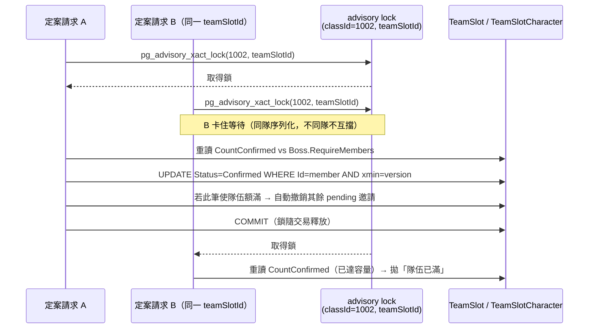
```mermaid
sequenceDiagram
    participant A as 定案請求 A
    participant B as 定案請求 B（同一 teamSlotId）
    participant Lock as advisory lock<br/>(classId=1002, teamSlotId)
    participant DB as TeamSlot / TeamSlotCharacter

    A->>Lock: pg_advisory_xact_lock(1002, teamSlotId)
    Lock-->>A: 取得鎖
    B->>Lock: pg_advisory_xact_lock(1002, teamSlotId)
    Note over B,Lock: B 卡住等待（同隊序列化，不同隊不互擋）
    A->>DB: 重讀 CountConfirmed vs Boss.RequireMembers
    A->>DB: UPDATE Status=Confirmed WHERE Id=member AND xmin=version
    A->>DB: 若此筆使隊伍額滿 → 自動撤銷其餘 pending 邀請
    A->>DB: COMMIT（鎖隨交易釋放）
    Lock-->>B: 取得鎖
    B->>DB: 重讀 CountConfirmed（已達容量）→ 拋「隊伍已滿」
```

`ConfirmMemberAsync` 取 `(classId=1002, teamSlotId)` 的交易級 `pg_advisory_xact_lock`（`IRegistrationLock.AcquireTeamSlotEditLockAsync`），在鎖內**重讀** `CountConfirmedAsync` 與 `Boss.RequireMembers` 比對容量，再用 `xmin`（`TeamSlotCharacter.Version`）樂觀鎖改狀態（狀態已被別人動過 → 0 rows → 「請重新整理」）。同隊定案序列化、防超編；不同隊的鎖互不阻塞。額滿時順帶 `RevokePendingInvitesAsync` 自動撤銷其餘待接受邀請（仍在同一把鎖內，不與「同時另一人接受」競態）。

### 跨隊分身：`uq_tsc_confirmed_overlap` 唯一索引

per-team 鎖管不到「同玩家在同時段的兩支不同隊都被定案」。這靠 DB 唯一索引原子擋（`SlotDateTime` 去正規化快照一份到 `TeamSlotCharacter` 上，因 Postgres unique 不能跨表）：

```sql
CREATE UNIQUE INDEX uq_tsc_confirmed_overlap
    ON "TeamSlotCharacter" ("DiscordId", "SlotDateTime")
    WHERE "Status" = 'Confirmed' AND "DiscordId" <> 0;
```

第二筆同玩家同時段的 `Confirmed` 撞 `23505` → `ExceptionHandlerMiddleware` 轉 **409**。另有 `uq_tsc_active_membership`（`TeamSlotId, DiscordId` where `Status in (Applied,Invited)`）擋重複邀請/申請。

### lock_timeout 安全邊際

`RegistrationLock` 取鎖前 `SET LOCAL lock_timeout`（預設 5 秒），區分「正常排隊等一下」跟「持鎖方卡死」：逾時拋 `AdvisoryLockTimeoutException`，`ConfirmMemberAsync` 接住轉「隊伍忙碌中，請稍後重試」。

> 選型：本規模用 advisory lock + xmin + 唯一索引即可，不需 SERIALIZABLE 重試迴圈或分散式鎖服務。

---

## 領域設計

### 核心實體

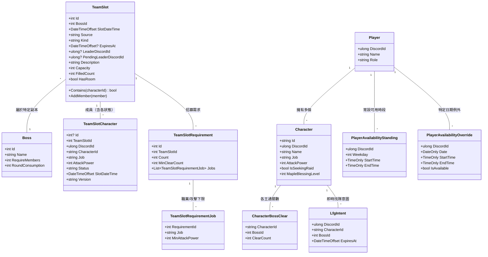
```mermaid
classDiagram
    class Player {
        +ulong DiscordId
        +string Name
        +string Role
    }
    class Character {
        +string Id
        +ulong DiscordId
        +string Name
        +string Job
        +int AttackPower
        +bool IsSeekingRaid
        +int MapleBlessingLevel
    }
    class Boss {
        +int Id
        +string Name
        +int RequireMembers
        +int RoundConsumption
    }
    class TeamSlot {
        +int Id
        +int BossId
        +DateTimeOffset SlotDateTime
        +string Source
        +string Kind
        +DateTimeOffset? ExpiresAt
        +ulong? LeaderDiscordId
        +ulong? PendingLeaderDiscordId
        +string Description
        +int Capacity
        +int FilledCount
        +bool HasRoom
        +Contains(characterId) bool
        +AddMember(member)
    }
    class TeamSlotCharacter {
        +int? Id
        +int TeamSlotId
        +ulong DiscordId
        +string CharacterId
        +string Job
        +int AttackPower
        +string Status
        +DateTimeOffset SlotDateTime
        +string Version
    }
    class TeamSlotRequirement {
        +int Id
        +int TeamSlotId
        +int Count
        +int MinClearCount
        +List~TeamSlotRequirementJob~ Jobs
    }
    class TeamSlotRequirementJob {
        +int RequirementId
        +string Job
        +int MinAttackPower
    }
    class PlayerAvailabilityStanding {
        +ulong DiscordId
        +int Weekday
        +TimeOnly StartTime
        +TimeOnly EndTime
    }
    class PlayerAvailabilityOverride {
        +ulong DiscordId
        +DateOnly Date
        +TimeOnly StartTime
        +TimeOnly EndTime
        +bool IsAvailable
    }
    class LfgIntent {
        +ulong DiscordId
        +string CharacterId
        +int BossId
        +DateTimeOffset ExpiresAt
    }
    class CharacterBossClear {
        +string CharacterId
        +int BossId
        +int ClearCount
    }

    Player "1" -- "*" Character : 擁有多個
    Player "1" -- "*" PlayerAvailabilityStanding : 常設可用時段
    Player "1" -- "*" PlayerAvailabilityOverride : 特定日期例外
    Character "1" -- "*" CharacterBossClear : 各王通關數
    Character "1" -- "*" LfgIntent : 即時找隊意圖
    TeamSlot "*" -- "1" Boss : 屬於特定副本
    TeamSlot "1" -- "*" TeamSlotCharacter : 成員（含各狀態）
    TeamSlot "1" -- "*" TeamSlotRequirement : 招募需求
    TeamSlotRequirement "1" -- "*" TeamSlotRequirementJob : 職業/攻擊下限
```

> **TeamSlot 是充血聚合**：`Capacity`/`HasRoom`/`Contains`/`AddMember` 守「不超員、不重複」不變式，違反丟 `DomainException`（`ExceptionHandlerMiddleware` 映射 400）。只維護記憶體物件圖，持久化由 service 端命令式 Dapper 完成（無 change-tracking）。`TeamSlotCharacter.Version` 是 Postgres `xmin` 轉字串，供入隊定案的樂觀鎖比對（見「入隊定案的併發控制」）；`TeamSlotCharacter.SlotDateTime` 是開團時間的去正規化快照，供跨隊重疊唯一索引。
> **候選資料來源**：`IsSeekingRaid`（角色參戰 opt-in）× `PlayerAvailabilityStanding`（常設時段，`PlayerAvailabilityOverride` 為特定日期蓋寫）× `CharacterBossClear`（通關數，過濾 `MinClearCount`）；即時團則走 `LfgIntent` 看板。

---

## 資料庫設計 (ERD)

使用 PostgreSQL 18，Dapper 手寫 SQL；schema 版本由 golang-migrate 管理（`db/migrations/`）。

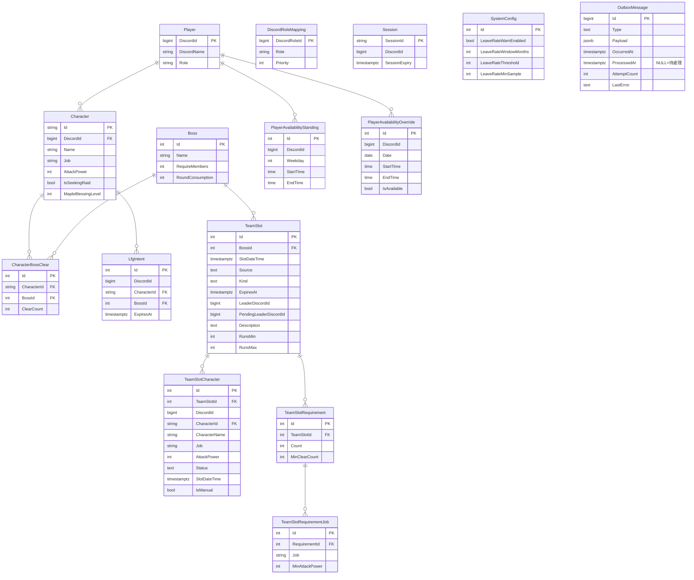
```mermaid
erDiagram
    Player {
        bigint DiscordId PK
        string DiscordName
        string Role
    }

    Character {
        string Id PK
        bigint DiscordId FK
        string Name
        string Job
        int AttackPower
        bool IsSeekingRaid
        int MapleBlessingLevel
    }

    Boss {
        int Id PK
        string Name
        int RequireMembers
        int RoundConsumption
    }

    PlayerAvailabilityStanding {
        int Id PK
        bigint DiscordId
        int Weekday
        time StartTime
        time EndTime
    }

    PlayerAvailabilityOverride {
        int Id PK
        bigint DiscordId
        date Date
        time StartTime
        time EndTime
        bool IsAvailable
    }

    CharacterBossClear {
        int Id PK
        string CharacterId FK
        int BossId FK
        int ClearCount
    }

    LfgIntent {
        int Id PK
        bigint DiscordId
        string CharacterId FK
        int BossId FK
        timestamptz ExpiresAt
    }

    TeamSlot {
        int Id PK
        int BossId FK
        timestamptz SlotDateTime
        text Source
        text Kind
        timestamptz ExpiresAt
        bigint LeaderDiscordId
        bigint PendingLeaderDiscordId
        text Description
        int RunsMin
        int RunsMax
    }

    TeamSlotCharacter {
        int Id PK
        int TeamSlotId FK
        bigint DiscordId
        string CharacterId FK
        string CharacterName
        string Job
        int AttackPower
        text Status
        timestamptz SlotDateTime
        bool IsManual
    }

    TeamSlotRequirement {
        int Id PK
        int TeamSlotId FK
        int Count
        int MinClearCount
    }

    TeamSlotRequirementJob {
        int Id PK
        int RequirementId FK
        string Job
        int MinAttackPower
    }

    DiscordRoleMapping {
        bigint DiscordRoleId PK
        string Role
        int Priority
    }

    Session {
        string SessionId PK
        bigint DiscordId
        timestamptz SessionExpiry
    }

    SystemConfig {
        int Id PK
        bool LeaveRateWarnEnabled
        int LeaveRateWindowMonths
        int LeaveRateThreshold
        int LeaveRateMinSample
    }

    OutboxMessage {
        bigint Id PK
        text Type
        jsonb Payload
        timestamptz OccurredAt
        timestamptz ProcessedAt "NULL=待處理"
        int AttemptCount
        text LastError
    }

    Player ||--o{ Character : ""
    Player ||--o{ PlayerAvailabilityStanding : ""
    Player ||--o{ PlayerAvailabilityOverride : ""
    Character ||--o{ CharacterBossClear : ""
    Character ||--o{ LfgIntent : ""
    Boss ||--o{ CharacterBossClear : ""
    Boss ||--o{ TeamSlot : ""
    TeamSlot ||--o{ TeamSlotCharacter : ""
    TeamSlot ||--o{ TeamSlotRequirement : ""
    TeamSlotRequirement ||--o{ TeamSlotRequirementJob : ""
```
---

## Discord 整合

### OAuth2 認證流程

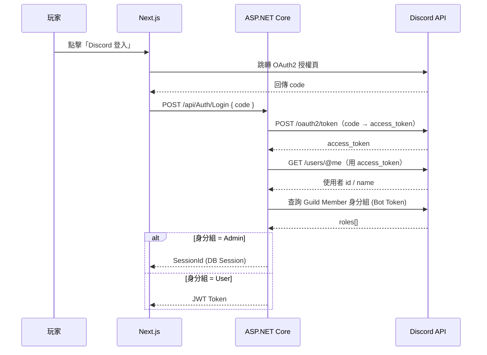
```mermaid
sequenceDiagram
    participant User as 玩家
    participant Frontend as Next.js
    participant API as ASP.NET Core
    participant Discord as Discord API

    User->>Frontend: 點擊「Discord 登入」
    Frontend->>Discord: 跳轉 OAuth2 授權頁
    Discord-->>Frontend: 回傳 code
    Frontend->>API: POST /api/Auth/Login { code }
    API->>Discord: POST /oauth2/token（code → access_token）
    Discord-->>API: access_token
    API->>Discord: GET /users/@me（用 access_token）
    Discord-->>API: 使用者 id / name
    API->>Discord: 查詢 Guild Member 身分組 (Bot Token)
    Discord-->>API: roles[]
    alt 身分組 = Admin
        API-->>Frontend: SessionId (DB Session)
    else 身分組 = User
        API-->>Frontend: JWT Token
    end
```

### Discord Bot 功能

| 功能 | 說明 |
|---|---|
| **組隊通知（DM）** | leader-led 狀態改動（邀請/接受/核准/額滿撤銷/解散…）經 transactional outbox → `TeamNotificationOutboxHandler` 發 Discord 私訊給對應玩家。**無每日頻道廣播**——通知一律走個人 DM | 
| **身分組同步** | 登入時透過 Bot Token 查詢 Discord Guild Member，判斷 `Admin` / `User`；`MemberUpdated`/`MemberRemoved` 事件即時撤銷 session |

---

## 主要服務一覽

| 服務 | 職責 |
|---|---|
| `TeamLeaderService` | Leader-led 組隊核心：開隊、候選過濾、Pull 邀請 / Push 申請、入隊定案、退隊、隊長轉讓 |
| `ProfileService` | 玩家「我的資料」：常設可用時段 + 角色參戰 opt-in（`IsSeekingRaid`）讀寫 |
| `LfgService` | 即時找隊意圖：玩家發起 / 撤銷自己的 `LfgIntent`（即時團候選來源；**非公開看板**，只回本人。同角色同王唯一 + upsert，見 migration `000020`） |
| `AvailabilityOverrideService` | 特定日期可用時段例外（蓋寫常設時段） |
| `CharacterService` | 角色 CRUD + per 角色 per 王通關數（`CharacterBossClear`）自填（帶擁有權檢查） |
| `BossService` | Boss CRUD |
| `SystemConfigService` | 系統設定（候選退團率警示參數）；變更走 outbox 通知 bot |
| `AuthAppService` | Discord OAuth2 流程、角色判斷、憑證核發 |
| `JwtService` / `SessionService` | JWT 核發驗證 / DB Session 管理 |
| `DiscordOAuthClient` | Discord REST API 呼叫（token 兌換、身分組查詢） |

---

## 部署

### Docker Compose

啟動順序由 health check 與 `depends_on` 控制：

```
database（healthcheck: pg_isready）
  ↓
migrate（golang-migrate up，完成後退出）
  ↓
backend / bot
  ↓
frontend → cloudflared
```

### Kubernetes

`k8s/` 目錄包含各服務的 Deployment / Service / PVC，以及：
- `k8s/migrate-job.yaml`：批次 Job，執行 migration 後完成
- `k8s/secrets.yaml`：Secret template（真實值不入 git）
- backend 掛 **liveness (`/health/live`) / readiness (`/health/ready`)** 探針：DB 掛時停止導流量但不重啟 pod；滾動更新時 readiness 沒綠的新 pod 不會接到流量。**其餘服務也各有探針**：database（`pg_isready`，liveness 容忍 exit 1）、redis（`redis-cli ping` / tcpSocket）、seq / frontend（HTTP `/health`）、cloudflared（`--metrics` 的 `/ready`）——分離 readiness/liveness 的通則同上（依賴掛掉時停導流量、不誤殺 pod）
- 所有服務都設 **resource requests/limits**（受限於單機 ~2GB 主機預算，數值偏保守）

Secrets 以 volume mount 方式掛載至 `/run/secrets/`，與 Docker secrets 路徑一致，應用程式設定無需因部署平台而異。

執行拓樸（namespace `maple-raid`）：

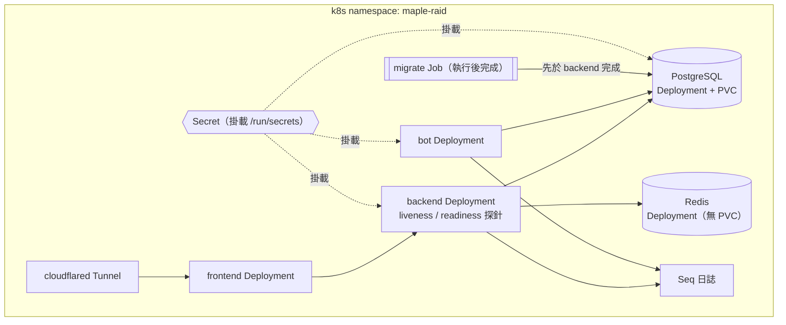
```mermaid
graph TD
    subgraph ns["k8s namespace: maple-raid"]
        mig[["migrate Job（執行後完成）"]]
        be["backend Deployment<br/>liveness / readiness 探針"]
        fe["frontend Deployment"]
        bot["bot Deployment"]
        db[("PostgreSQL<br/>Deployment + PVC")]
        redis[("Redis<br/>Deployment（無 PVC）")]
        seq["Seq 日誌"]
        cf["cloudflared Tunnel"]
        sec{{"Secret（掛載 /run/secrets）"}}
    end
    cf --> fe --> be --> db
    bot --> db
    be --> redis
    be --> seq
    bot --> seq
    mig -->|先於 backend 完成| db
    sec -. 掛載 .-> be
    sec -. 掛載 .-> bot
    sec -. 掛載 .-> db
```

- **CI**（GitHub Actions，`ci.yml`）：PR 綠燈才 merge，純文件變更自動跳過重量級 job。細節見下方流程圖 + `docs/e2e-testing-setup.md`。
- **CD**（GitHub Actions，`deploy.yml`，跟 CI 完全獨立）：`workflow_dispatch` 人工手動觸發，SHA 版本化映像 + Kustomize 滾動更新。細節見 `docs/cd-deploy-setup.md`。
- **手動部署**（不走 CI，本機直接操作）：`docs/deployment.md`（`deploy.ps1` / `rollout.ps1`）。

### CI/CD 流程（總覽）

CI 已遷 **GitHub Actions**（`.github/workflows/ci.yml` + `deploy.yml`），跟 `cd-deploy-setup` / `e2e-testing-setup` 兩份筆記對照：

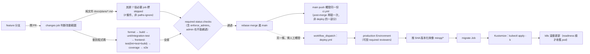
```mermaid
flowchart LR
    dev["feature 分支"] -->|開 PR| gate["changes job 判斷改動範圍"]
    gate -->|純文件 docs/plans/*.md| skip["其餘 7 個必要 job 標 skipped\n（if 條件，非 paths-ignore）"]
    gate -->|動到程式碼| ci["format → build → unit/integration-test\n→ frontend-test(lint+test+build) → coverage → e2e"]
    skip --> checks{"required status checks\n（含 enforce_admins，admin 也不能繞過）"}
    ci -->|全綠| checks
    checks -->|通過| merge["rebase merge 進 main"]
    merge --> mainci["main push 觸發同一份 ci.yml\n（post-merge 再驗一次，非 deploy 的一部分）"]
    merge -.->|另一條、需人工觸發| dispatch["workflow_dispatch：deploy.yml"]
    dispatch --> envgate["production Environment\n（可設 required reviewers）"]
    envgate --> deploy["推 SHA 版本化映像 minqq/*"]
    deploy --> mig["migrate Job"]
    mig --> k["Kustomize：kubectl apply -k"]
    k --> roll["k8s 滾動更新（readiness 綠才收舊 pod）"]
```

> **PR 閘**：`changes` job 用 `dorny/paths-filter` 判斷這次改動是否只碰文件；純文件時其餘 job 用 `if:` 條件跳過（標 skipped），不是在 `on:` 用 `paths-ignore`——後者會讓 workflow 整個不觸發，required status checks 永遠等不到回報、PR 會卡死。GitHub 把 skipped 視為通過，required checks 照樣滿足。
> **`main` 分支保護**：required status checks（上述 7 個 job）+ 禁止 force push/刪除 + **`enforce_admins` 開啟**（admin 帳號也一樣得走 PR，不能直接推）。
> **CI 跟 deploy 是兩條獨立流程**：push 進 `main` 只會重跑一次 `ci.yml`（post-merge 守門，不是 deploy 的前置步驟）；`deploy.yml` 是完全獨立、`workflow_dispatch` 手動觸發、掛 `production` Environment 當核准閘。映像以 git SHA 版本化 → 可追溯、可真 rollback（`kubectl rollout undo` 或指定 SHA）。