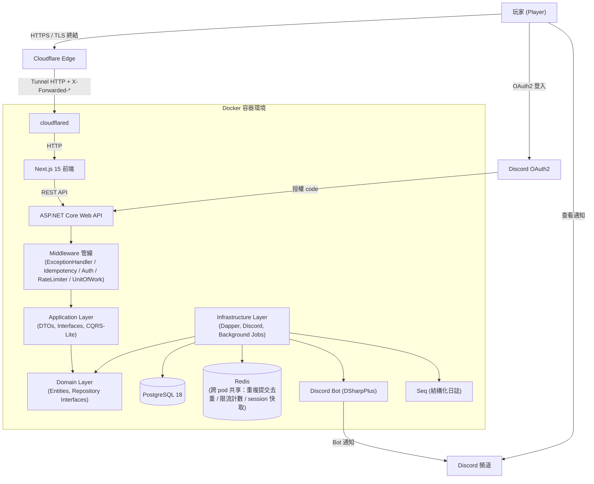
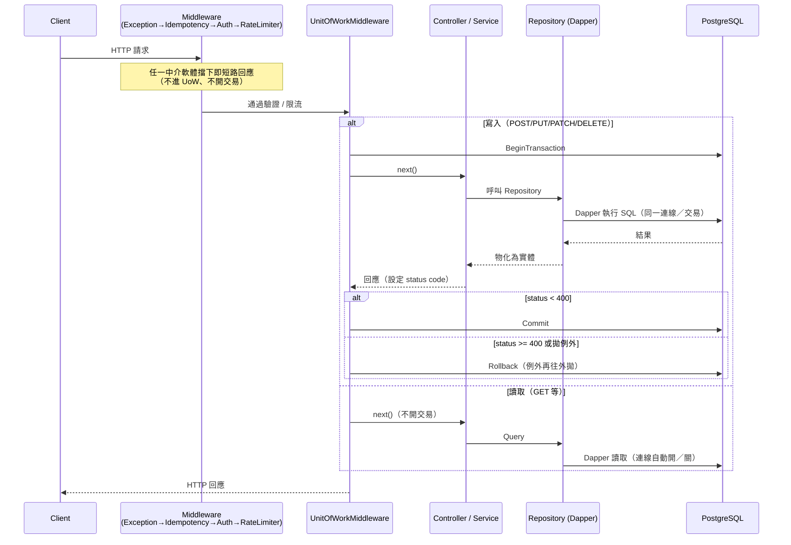
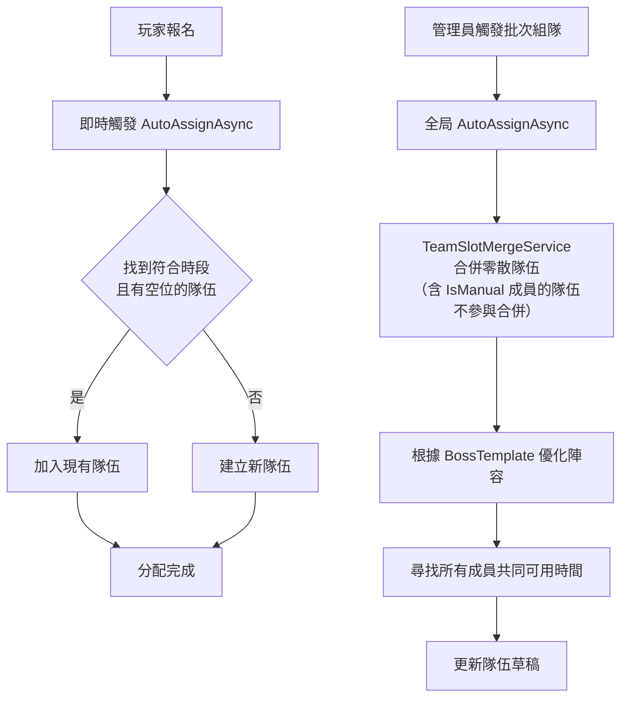
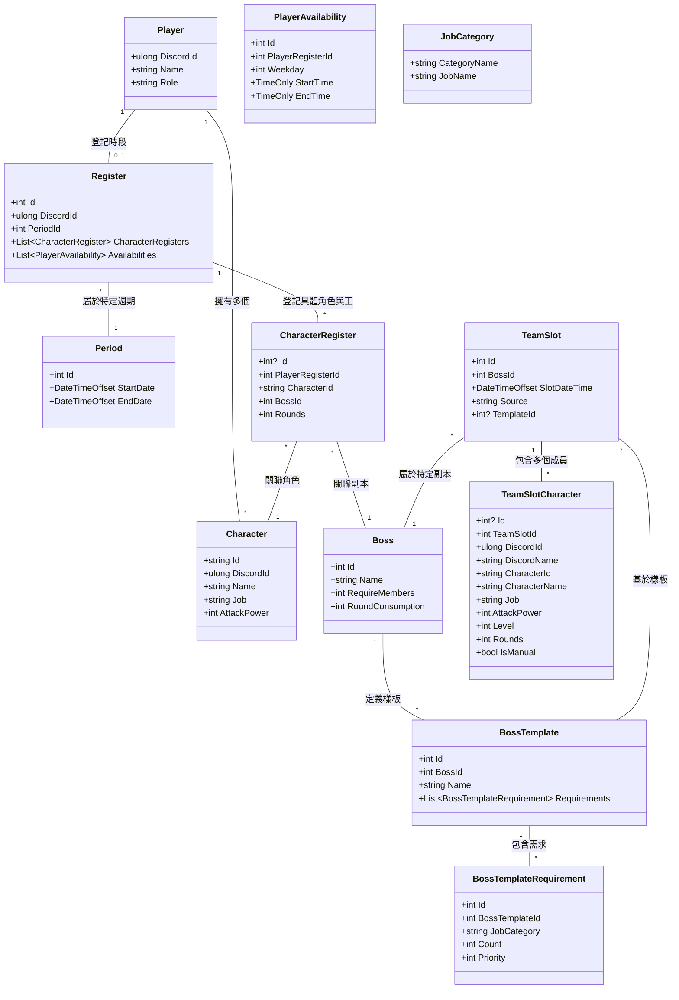
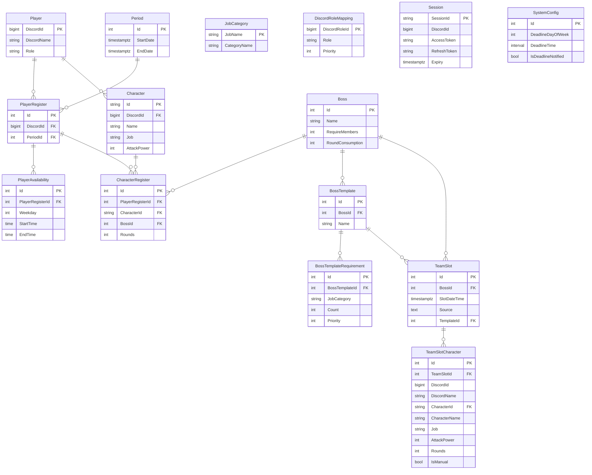
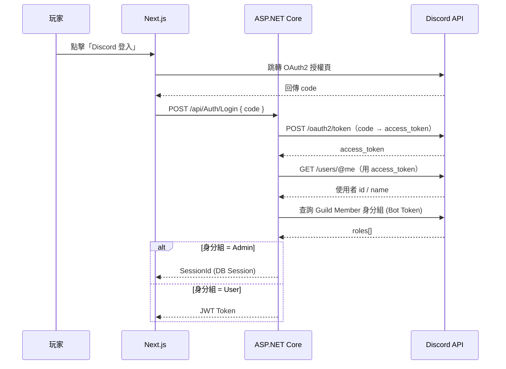
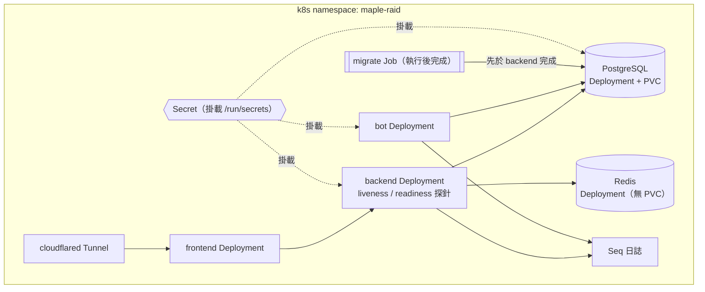
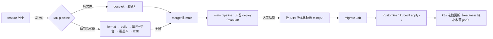

# 架構設計文件 — MapleStory Raid Scheduler

本文件說明系統的整體架構、關鍵設計決策與實作細節，適合快速了解系統設計思路。

---

## 系統架構總覽

### 高階架構圖


```mermaid
graph TD
    User["玩家 (Player)"] -->|HTTPS / TLS 終結| Cloudflare["Cloudflare Edge"]
    Cloudflare -->|Tunnel HTTP + X-Forwarded-*| Cloudflared["cloudflared"]

    subgraph "Docker 容器環境"
        Cloudflared -->|HTTP| Frontend["Next.js 15 前端"]
        Frontend -->|REST API| Backend["ASP.NET Core Web API"]
        Backend --> Middleware["Middleware 管線\n(ExceptionHandler / Idempotency / Auth / RateLimiter / UnitOfWork)"]
        Middleware --> Application["Application Layer\n(DTOs, Interfaces, CQRS-Lite)"]
        Application --> Domain["Domain Layer\n(Entities, Repository Interfaces)"]
        Infrastructure["Infrastructure Layer\n(Dapper, Discord, Background Jobs)"] --> Domain

        Infrastructure --> DB[("PostgreSQL 18")]
        Infrastructure --> Redis[("Redis\n(跨 pod 共享：重複提交去重 / 限流計數 / session 快取)")]
        Infrastructure --> DiscordBot["Discord Bot (DSharpPlus)"]
        Infrastructure --> Seq["Seq (結構化日誌)"]
    end

    DiscordBot -->|Bot 通知| DiscordChannel["Discord 頻道"]
    User -->|查看通知| DiscordChannel
    User -->|OAuth2 登入| DiscordOAuth["Discord OAuth2"]
    DiscordOAuth -->|授權 code| Backend
```

### 分層架構與依賴方向

```
Presentation.WebApi  →  Application  →  Domain
                              ↓
                       Infrastructure
```

| 層級 | 職責 | 設計原則 |
|---|---|---|
| **Domain** | 核心實體、Repository 介面、業務規則 | 零外部依賴，可獨立單元測試 |
| **Application** | DTOs、服務介面、查詢介面 | 定義業務邊界，不含實作細節 |
| **Infrastructure** | Dapper Repository、Discord 整合、背景作業 | 實作所有 I/O，依賴注入替換 |
| **Presentation.WebApi** | Controller、Middleware 管線 | 薄控制器，業務邏輯不在此層 |

---

## 關鍵設計決策

### 1. 不使用 EF Core（Runtime），改用 Dapper + 自製 SqlBuilder

**決策原因**：Runtime 不用 EF Core 是刻意選擇——主要想理解無模型（model-less）的資料存取。誠實說，EF Core 也能手寫 SQL（`FromSqlRaw`），這不是能力上的必要；Dapper 真正獨有的是不背 ORM 模型、輕量映射。以這專案規模，EF Core 其實更務實，選 Dapper 偏學習導向。手寫 SQL 的字串散落問題，用自製 SqlBuilder（Expression Tree 解析 Lambda 產生型別安全 SQL）解掉。

> **注意**：`Infrastructure/Migrations/MigrationDbContext` 僅供 design-time 使用（詳見第 6 點），不注冊到 DI，不影響 runtime 行為。

**實作方式**：自製 `Utils/SqlBuilder/`，以 C# Expression Tree 解析 Lambda 表達式為 SQL 條件：

```csharp
// 型別安全，編譯期檢查欄位名稱
Sql.Query<CharacterDbModel>()
   .Where(c => c.DiscordId == discordId && c.Job != null)
   .Select(c => new { c.Id, c.Name, c.Job })
   .Build();
```

| 類別 | 功能 |
|---|---|
| `QueryBuilder` / `TypedQueryBuilder` | SELECT 查詢，支援 Lambda 選欄 |
| `InsertBuilder` / `UpdateBuilder` / `DeleteBuilder` | 寫入操作 |
| `CteBuilder` | CTE（WITH 子句）建構 |
| `SqlConditionGroup` | AND/OR 條件群組組合 |
| `SqlExpressionVisitor` | 解析 Lambda 為 SQL，支援 NULL 比較 |

### 2. CQRS-Lite 讀寫分離

**決策原因**：讀取與寫入的**模型不同**——寫入用 entity + `UnitOfWork` 事務保護與業務驗證，讀取需要跨表 JOIN 回**專用 DTO**、不受寫入模型約束。分開讓讀側能自由最佳化查詢。

> 這是 CQRS 的**核心原則**（讀寫責任分離），但本專案是**同一資料庫、強一致的輕量版（CQRS-Lite）**，非「獨立讀庫 + 物化視圖 + 事件溯源 + 最終一致」的完整型 CQRS。停在輕量版對此規模是刻意取捨。

**實作方式**：
- **寫入 (Command)**：`Application/Interface/` 定義介面 → `Infrastructure/Services/` 實作，走 `UnitOfWork` 事務。
- **讀取 (Query)**：`Application/Queries/` 定義介面 → `Infrastructure/Query/` 實作，直接執行 JOIN SQL，不走事務。

```
寫入路徑：Controller → IXxxService → IRepository → DB（UnitOfWork 包裹）
讀取路徑：Controller → IXxxQuery  → QueryBuilder → DB（無事務）
```

### 3. Unit of Work 模式

**決策原因**：一個 HTTP 請求可能涉及多個 Repository 操作，需保證原子性。

**實作方式**：`UnitOfWorkMiddleware` 在請求進入前開啟 `NpgsqlConnection` + `NpgsqlTransaction`，成功後 commit，例外時 rollback。所有 Repository 共享同一連線。

```csharp
// UnitOfWorkMiddleware.cs
await _unitOfWork.BeginTransactionAsync();
await next(context);
await _unitOfWork.CommitAsync();
```

### 4. 雙軌身分驗證

**決策原因**：一般玩家與管理員的驗證需求不同——玩家走 Discord OAuth2 取得 JWT（無狀態），管理員需要更嚴格的 Session 控管（可強制登出）。

**實作方式**：`AuthenticationMiddleware` 統一入口，依 Token 類型分流：

| 類型 | 機制 | 儲存位置 |
|---|---|---|
| 一般玩家 | 自定義 JWT | 客戶端 Cookie |
| 管理員 | SessionId | DB `session` 表 |

Discord 身分組 → 系統角色的對應由 `DiscordRoleMapping` 表管理，可動態調整。

**Session 快取（跨 pod 撤銷）**：管理員 session 讀取走快取，存 **Redis**（`ISessionCache` / `RedisSessionCache`）而非 per-pod `IMemoryCache`——所以 `DeleteAsync` / `DeleteByDiscordAsync` 撤銷（登出、拔身分組、踢人）**一次刪除即在所有 pod 立即生效**，不再是「只清當下 pod、其他 pod 等 TTL」。**讀**穿快取 miss 退回查 DB 自癒；Redis 不可用時 fail-open（退回查 DB，DB 為真實來源）。

### 5. 重複提交防護（非完整冪等）

**決策原因**：前端連點或網路重送可能造成重複寫入（如重複報名、重複補位）。

**實作方式**：POST/PUT/DELETE 必須帶合法 UUID 的 `X-Idempotency-Key`（缺少或非 UUID 回 400）；`IdempotencyMiddleware` 以此 Key 去重，同一 Key 在 60 秒內重送直接回 **409 Conflict**、不進入業務邏輯。去重狀態存 **Redis**（`SET NX EX`，跨 pod 共享；經 `IIdempotencyStore` 抽象）——取代原本 per-pod 的 `IMemoryCache`。Redis 不可用時採 **fail-open**（放行 + 記 log，不因去重快取抖動擋掉寫入；真正的重複由報名 `ExistAsync` + auto-assign advisory lock 兜底）。

> 注意：這是「擋重送」而非完整冪等——重試不會重播第一次的回應內容（只快取一個標記，非結果）。真冪等需快取並重播原始回應；此處刻意簡化為 de-dup，因寫入操作重送應由使用者感知（409）而非默默視為成功。

### 6. Schema 版本管理（golang-migrate）

**決策原因**：手寫 SQL 無 ORM migration 機制，多環境（dev / prod）的 schema 需要明確的版本追蹤與 rollback 能力，確保環境一致性與部署安全。

**實作方式**：`db/migrations/` 存放有序號的 up/down SQL 檔，migrate service 在 backend 啟動前執行。

```
db/migrations/
  000001_init_schema.up.sql    ← 建立全部資料表與索引
  000001_init_schema.down.sql  ← DROP 全部資料表（反向 FK 順序）
  000002_xxx.up.sql            ← 後續 schema 變更
  000002_xxx.down.sql
```

**新增 Migration 工作流程**：

```bash
# 1. 修改 Infrastructure/Entities/*DbModel.cs

# 2. 執行草稿產生器（自動完成 ef diff → SQL 輸出 → 清理 .cs）
bash db/create-migration.sh <MigrationName>

# 3. 審閱並補齊產出的 SQL 草稿：
#    db/migrations/000002_<name>.up.sql   ← 補 FK constraints / indexes
#    db/migrations/000002_<name>.down.sql ← 確認 rollback 正確性
```

`db/create-migration.sh` 流程說明（Zero DB、Zero State File）：
- `ef migrations add <Name>` → rebuild 專案、產生 C# diff、更新 Snapshot
- `ef migrations script 0 <new>` → up SQL 草稿
- `ef migrations script <new> 0` → down SQL 草稿
- 過濾 `__EFMigrationsHistory`、`START TRANSACTION`、`COMMIT`
- 刪除 .cs migration 檔（保留 Snapshot 作為下次 diff 基線）

> **為何 `from=0` 可行**：`ef migrations add` 強制 rebuild，新 DLL 只含剛加入的 migration（舊 .cs 已刪），`script 0 NewMig` 因此只產生該次的增量 SQL。此行為依賴 assembly-based（非 file-based）的 migration 掃描機制。

> **版本鎖定要求**：EF Core 的 SQL 生成行為依賴具體版本。升版前需重新驗證 script 輸出。目前鎖定版本：`Npgsql.EntityFrameworkCore.PostgreSQL 9.0.4`、`Microsoft.EntityFrameworkCore.Design 9.0.4`。

Migration image 以 `db/Dockerfile.migrate` 自製（golang-migrate 基底 + SQL 烤入），新增 migration 只需 rebuild image，k8s YAML 不需改動。

**Rollback 策略**：

| 情境 | 做法 |
|---|---|
| 本機開發 reset | `migrate down 1` → `migrate up` |
| Production 出問題 | PostgreSQL PITR / DB snapshot restore |
| Schema 寫錯 | 補一版 forward fix migration（`000003_fix_xxx.up.sql`） |

`down.sql` 是開發工具，不是 production rollback 機制。Production 回滾依賴 infrastructure 層（DB snapshot），而非應用層 migration。

### 7. 設定變更的可靠投遞（Transactional Outbox）

**決策原因**：設定變更（報名截止）後要喚醒背景 job 重算。原本用 `DbContext.AfterCommit`（in-process post-commit hook），有兩個問題：(1) commit 後、跑動作前 crash 會**遺失**；(2) 設定在 **API** 改、要喚醒的 `RegistrationDeadlineJob` 在 **bot**，in-process 事件**跨不了行程**（API 的 `ConfigChangeNotifier` 無訂閱者 = no-op）→ API 改設定不會即時通知 bot。

**實作方式**：改用 transactional outbox（`OutboxMessage` 表）。

| 端 | 元件 | 做法 |
|---|---|---|
| 寫入 | `IOutbox` / `Outbox` | 用**當前 UoW 的交易** INSERT outbox 列 → 與業務資料**原子提交/回滾**（rollback 無鬼影事件） |
| 派發 | `OutboxDispatcher`（跑 bot、自開專屬連線） | 輪詢已提交列 → 依 `Type` 派 `IOutboxHandler` → 標 `ProcessedAt` |

- **多 pod 分工**：`SELECT ... FOR UPDATE SKIP LOCKED` → 多個 dispatcher 各撈不相交批、互不重投、免選 leader。
- **at-least-once + 冪等**：投遞成功、標 processed 前崩 → 重送；靠 handler 冪等（`ConfigChanged` 只是喚醒 job 重讀）吸收。
- partial index（`WHERE "ProcessedAt" IS NULL`）撈取快；重試上限後放棄、記 `LastError`。

> outbox 把「要送什麼」持久化進交易 → 解掉 AfterCommit 的 crash-loss 與跨行程限制。定位為 readiness（現況 replicas=1、副作用可補），但順帶修掉跨行程 gap。

---

## Middleware 管線

請求進入後依序經過：

```
Request
  │
  ▼
ExceptionHandlerMiddleware   ← 全域例外捕捉，統一回傳 ProblemDetails
  │
  ▼
IdempotencyMiddleware        ← 強制 X-Idempotency-Key（否則 400），重送回 409 擋重複提交
  │
  ▼
AuthenticationMiddleware     ← 驗證 JWT（玩家）或 SessionId（管理員），設 discordId claim
  │
  ▼
RateLimiter                  ← 登入後按 discordId 限流（100/10s/人，計數存 Redis 固定視窗故跨 pod 共用上限；Redis 掛則 fail-open 放行）；放此處故被擋的請求不白開 DB 交易
  │
  ▼
UnitOfWorkMiddleware         ← 開啟 DB 事務，成功 Commit，例外 Rollback
  │
  ▼
Controller / Service
```

> **限流為何按身分不按 IP**：`discordId` 來自已驗證的 session/JWT，client 偽造不了，換 IP 也繞不掉；且前端 proxy 會剝除 `X-Forwarded-For`／`cf-connecting-ip`，後端本就看不到真實 IP。未登入端點（登入前暴力破解）不在此限——那需 IP／CAPTCHA／帳號鎖定，屬另案。

> **健康檢查端點例外**：`/health/live`、`/health/ready` 以 `UseHealthChecks` **終端中介軟體**掛在這條管線**之前**，完全繞過後面所有中介軟體。
> 原因：探針不該需要認證、也不該開交易；readiness 的 DB 檢查走專屬 `DatabaseHealthCheck`（不經請求管線）→ DB 掛掉乾淨回 503，liveness 不查 DB 故不誤殺 pod。詳見 `docs/cd-deploy-setup.md`。

### 請求生命週期（交易邊界）

上面是「管線順序」；下圖是「一個請求的時間流」，重點在 **UnitOfWork 的交易邊界**與 **Dapper 沿用同一連線／交易**：


```mermaid
sequenceDiagram
    participant C as Client
    participant MW as Middleware<br/>(Exception→Idempotency→Auth→RateLimiter)
    participant UoW as UnitOfWorkMiddleware
    participant Ctrl as Controller / Service
    participant Repo as Repository (Dapper)
    participant DB as PostgreSQL

    C->>MW: HTTP 請求
    Note over MW: 任一中介軟體擋下即短路回應<br/>（不進 UoW、不開交易）
    MW->>UoW: 通過驗證 / 限流
    alt 寫入（POST/PUT/PATCH/DELETE）
        UoW->>DB: BeginTransaction
        UoW->>Ctrl: next()
        Ctrl->>Repo: 呼叫 Repository
        Repo->>DB: Dapper 執行 SQL（同一連線／交易）
        DB-->>Repo: 結果
        Repo-->>Ctrl: 物化為實體
        Ctrl-->>UoW: 回應（設定 status code）
        alt status < 400
            UoW->>DB: Commit
        else status >= 400 或拋例外
            UoW->>DB: Rollback（例外再往外拋）
        end
    else 讀取（GET 等）
        UoW->>Ctrl: next()（不開交易）
        Ctrl->>Repo: Query
        Repo->>DB: Dapper 讀取（連線自動開／關）
    end
    UoW-->>C: HTTP 回應
```

> 交易邊界由中介軟體統一掌控，**Controller／Repository 不碰交易生命週期**——這是 Unit of Work 的核心：一個請求一個交易，成功才 Commit，任何失敗（4xx 或例外）整批 Rollback。詳見上方「關鍵設計決策 §3」。

---

## 自動分配引擎

這是系統最核心的業務邏輯，分為三個階段：

### 流程圖


```mermaid
flowchart TD
    A[玩家報名] --> B[即時觸發 AutoAssignAsync]
    B --> C{找到符合時段\n且有空位的隊伍}
    C -->|是| D[加入現有隊伍]
    C -->|否| E[建立新隊伍]
    D --> F[分配完成]
    E --> F

    G[管理員觸發批次組隊] --> H[全局 AutoAssignAsync]
    H --> I[TeamSlotMergeService\n合併零散隊伍\n（含 IsManual 成員的隊伍不參與合併）]
    I --> J[根據 BossTemplate 優化陣容]
    J --> K[尋找所有成員共同可用時間]
    K --> L[更新隊伍草稿]
```

### 補位保護機制

手動補位的成員標記 `IsManual = true`，批次重新分配時跳過含 `IsManual` 成員的隊伍，防止人工調整被覆蓋。

### 併發控制（避免重複開隊）

`AutoAssignAsync` 的「讀現有隊 → 沒有就開新隊」是 **read-then-write**。兩人同時報名同一 period 時，在 READ COMMITTED 下兩交易互相看不到對方未提交的隊 → **各自開一隊 → 重複**（`MergeTeamsAsync` 只能事後補救，併發當下補不了）。

解法：`AutoAssignAsync` 開頭對 `(classId, periodId)` 取 **交易級 advisory lock**（`pg_advisory_xact_lock`，見 `IRegistrationLock`）：

- 同一 period 的自動排隊**序列化** → 第二個看得到第一個建的隊
- **不同 period 不互斥**（並行保留，per-key 粒度）
- 交易級鎖隨 UoW commit/rollback **自動釋放**；鎖在 DB → **多 pod 安全**（不像 C# 程序內鎖，多副本會失效）

> 選型：本規模用 advisory lock（targeted + 多 pod 安全 + 一行 SQL）即可；SERIALIZABLE 需重試迴圈、MQ 需常駐 broker，對一團數十人過重。公開路人配對、熱門本高併發 + 尖峰時，才會走「非同步配對管線（佇列 + worker）」重設計。

### Source 語意（provenance）

隊伍來源，取代舊 `IsTemporary`/`IsPublished` 兩布林。驅動：空隊自動清除、合併資格、批次重排保留。

| 值 | 來源 | 說明 |
|---|---|---|
| `auto` | `TeamSlotAutoAssignService` | 玩家報名時系統自動建立，空時可自動清除、可被合併 |
| `admin` | Admin 手動開團 / `ScheduleService` 批次重排 | Admin 建立，空時不自動刪除、不被自動合併、重排時保留 |

---

## 領域設計

### 核心實體


```mermaid
classDiagram
    class Player {
        +ulong DiscordId
        +string Name
        +string Role
    }
    class Character {
        +string Id
        +ulong DiscordId
        +string Name
        +string Job
        +int AttackPower
    }
    class Boss {
        +int Id
        +string Name
        +int RequireMembers
        +int RoundConsumption
    }
    class Period {
        +int Id
        +DateTimeOffset StartDate
        +DateTimeOffset EndDate
    }
    class Register {
        +int Id
        +ulong DiscordId
        +int PeriodId
        +List~CharacterRegister~ CharacterRegisters
        +List~PlayerAvailability~ Availabilities
    }
    class CharacterRegister {
        +int? Id
        +int PlayerRegisterId
        +string CharacterId
        +int BossId
        +int Rounds
    }
    class TeamSlot {
        +int Id
        +int BossId
        +DateTimeOffset SlotDateTime
        +string Source
        +int? TemplateId
    }
    class TeamSlotCharacter {
        +int? Id
        +int TeamSlotId
        +ulong DiscordId
        +string DiscordName
        +string CharacterId
        +string CharacterName
        +string Job
        +int AttackPower
        +int Level
        +int Rounds
        +bool IsManual
    }
    class PlayerAvailability {
        +int Id
        +int PlayerRegisterId
        +int Weekday
        +TimeOnly StartTime
        +TimeOnly EndTime
    }
    class BossTemplate {
        +int Id
        +int BossId
        +string Name
        +List~BossTemplateRequirement~ Requirements
    }
    class BossTemplateRequirement {
        +int Id
        +int BossTemplateId
        +string JobCategory
        +int Count
        +int Priority
    }
    class JobCategory {
        +string CategoryName
        +string JobName
    }

    Player "1" -- "*" Character : 擁有多個
    Player "1" -- "0..1" Register : 登記時段
    Register "*" -- "1" Period : 屬於特定週期
    Register "1" -- "*" CharacterRegister : 登記具體角色與王
    CharacterRegister "*" -- "1" Boss : 關聯副本
    CharacterRegister "*" -- "1" Character : 關聯角色
    TeamSlot "*" -- "1" Boss : 屬於特定副本
    TeamSlot "1" -- "*" TeamSlotCharacter : 包含多個成員
    Boss "1" -- "*" BossTemplate : 定義樣板
    BossTemplate "1" -- "*" BossTemplateRequirement : 包含需求
    TeamSlot "*" -- "0..1" BossTemplate : 基於樣板
```

---

## 資料庫設計 (ERD)

使用 PostgreSQL 18，Dapper 手寫 SQL；schema 版本由 golang-migrate 管理（`db/migrations/`）。


```mermaid
erDiagram
    Player {
        bigint DiscordId PK
        string DiscordName
        string Role
    }

    PlayerRegister {
        int Id PK
        bigint DiscordId FK
        int PeriodId FK
    }

    PlayerAvailability {
        int Id PK
        int PlayerRegisterId FK
        int Weekday
        time StartTime
        time EndTime
    }

    CharacterRegister {
        int Id PK
        int PlayerRegisterId FK
        string CharacterId FK
        int BossId FK
        int Rounds
    }

    Character {
        string Id PK
        bigint DiscordId FK
        string Name
        string Job
        int AttackPower
    }

    Boss {
        int Id PK
        string Name
        int RequireMembers
        int RoundConsumption
    }

    BossTemplate {
        int Id PK
        int BossId FK
        string Name
    }

    BossTemplateRequirement {
        int Id PK
        int BossTemplateId FK
        string JobCategory
        int Count
        int Priority
    }

    Period {
        int Id PK
        timestamptz StartDate
        timestamptz EndDate
    }

    TeamSlot {
        int Id PK
        int BossId FK
        timestamptz SlotDateTime
        text Source
        int TemplateId FK
    }

    TeamSlotCharacter {
        int Id PK
        int TeamSlotId FK
        bigint DiscordId
        string DiscordName
        string CharacterId FK
        string CharacterName
        string Job
        int AttackPower
        int Rounds
        bool IsManual
    }

    JobCategory {
        string JobName PK
        string CategoryName
    }

    DiscordRoleMapping {
        bigint DiscordRoleId PK
        string Role
        int Priority
    }

    Session {
        string SessionId PK
        bigint DiscordId
        string AccessToken
        string RefreshToken
        timestamptz Expiry
    }

    SystemConfig {
        int Id PK
        int DeadlineDayOfWeek
        interval DeadlineTime
        bool IsDeadlineNotified
    }

    Player ||--o{ PlayerRegister : ""
    Period ||--o{ PlayerRegister : ""
    PlayerRegister ||--o{ PlayerAvailability : ""
    PlayerRegister ||--o{ CharacterRegister : ""
    Character ||--o{ CharacterRegister : ""
    Boss ||--o{ CharacterRegister : ""
    Player ||--o{ Character : ""
    Boss ||--o{ BossTemplate : ""
    BossTemplate ||--o{ BossTemplateRequirement : ""
    Boss ||--o{ TeamSlot : ""
    BossTemplate ||--o{ TeamSlot : ""
    TeamSlot ||--o{ TeamSlotCharacter : ""
```
---

## Discord 整合

### OAuth2 認證流程


```mermaid
sequenceDiagram
    participant User as 玩家
    participant Frontend as Next.js
    participant API as ASP.NET Core
    participant Discord as Discord API

    User->>Frontend: 點擊「Discord 登入」
    Frontend->>Discord: 跳轉 OAuth2 授權頁
    Discord-->>Frontend: 回傳 code
    Frontend->>API: POST /api/Auth/Login { code }
    API->>Discord: POST /oauth2/token（code → access_token）
    Discord-->>API: access_token
    API->>Discord: GET /users/@me（用 access_token）
    Discord-->>API: 使用者 id / name
    API->>Discord: 查詢 Guild Member 身分組 (Bot Token)
    Discord-->>API: roles[]
    alt 身分組 = Admin
        API-->>Frontend: SessionId (DB Session)
    else 身分組 = User
        API-->>Frontend: JWT Token
    end
```

### Discord Bot 功能

| 功能 | 說明 |
|---|---|
| **每日提醒** | 背景作業每天掃描當日 `TeamSlot`，Bot 標記玩家提醒行程 |
| **截止提醒** | 報名截止日自動觸發，附上排程結果 URL |
| **身分組同步** | 登入時透過 Bot Token 查詢 Discord Guild Member，判斷 `Admin` / `User` |

---

## 主要服務一覽

| 服務 | 職責 |
|---|---|
| `RegisterService` | 玩家報名寫入，報名後觸發即時自動排程 |
| `TeamSlotAutoAssignService` | 自動排程核心：即時分配 + 批次排程 |
| `TeamSlotMergeService` | 合併零散隊伍，根據 BossTemplate 優化陣容 |
| `TeamSlotCharacterService` | 補位、移除成員，設定 `IsManual` 保護旗標 |
| `AuthAppService` | Discord OAuth2 流程、角色判斷、憑證核發 |
| `JwtService` / `SessionService` | JWT 核發驗證 / DB Session 管理 |
| `DiscordOAuthClient` | Discord REST API 呼叫（token 兌換、身分組查詢） |
| `ScheduleService` | 背景作業協調（每日提醒、截止提醒） |

---

## 部署

### Docker Compose

啟動順序由 health check 與 `depends_on` 控制：

```
database（healthcheck: pg_isready）
  ↓
migrate（golang-migrate up，完成後退出）
  ↓
backend / bot
  ↓
frontend → cloudflared
```

### Kubernetes

`k8s/` 目錄包含各服務的 Deployment / Service / PVC，以及：
- `k8s/migrate-job.yaml`：批次 Job，執行 migration 後完成
- `k8s/secrets.yaml`：Secret template（真實值不入 git）
- backend 掛 **liveness (`/health/live`) / readiness (`/health/ready`)** 探針：DB 掛時停止導流量但不重啟 pod；滾動更新時 readiness 沒綠的新 pod 不會接到流量

Secrets 以 volume mount 方式掛載至 `/run/secrets/`，與 Docker secrets 路徑一致，應用程式設定無需因部署平台而異。

執行拓樸（namespace `maple-raid`）：


```mermaid
graph TD
    subgraph ns["k8s namespace: maple-raid"]
        mig[["migrate Job（執行後完成）"]]
        be["backend Deployment<br/>liveness / readiness 探針"]
        fe["frontend Deployment"]
        bot["bot Deployment"]
        db[("PostgreSQL<br/>Deployment + PVC")]
        redis[("Redis<br/>Deployment（無 PVC）")]
        seq["Seq 日誌"]
        cf["cloudflared Tunnel"]
        sec{{"Secret（掛載 /run/secrets）"}}
    end
    cf --> fe --> be --> db
    bot --> db
    be --> redis
    be --> seq
    bot --> seq
    mig -->|先於 backend 完成| db
    sec -. 掛載 .-> be
    sec -. 掛載 .-> bot
    sec -. 掛載 .-> db
```

- **CI（MR 流程）**：feature 分支 → 開 MR → CI 在 MR 上跑 **format（Roslyn 格式檢查）→ build（含 `WarningsAsErrors=nullable`）→ 單元 + 整合測試（dind + Testcontainers）→ 覆蓋率合併 → E2E**，綠燈才 merge。純文件 MR 只跑秒過的 `docs-ok`（滿足 merge check、不燒重的 job）。見 `docs/e2e-testing-setup.md`、`docs/gitlab-selfhost-ci-setup.md`（自架學習參考，實際已用 gitlab.com）。
- **CD**：merge 進 main → main pipeline **只留 `deploy`（manual、限 main）**，不重跑驗證。點下去 → 推 **SHA 版本化**的 `minqq/*` 映像 → migrate Job → **Kustomize `kubectl apply -k`**（映像 pin git SHA、可真回滾）。見 `docs/cd-deploy-setup.md`。
- **手動部署**（不走 CI）：`docs/deployment.md`（`deploy.ps1` / `rollout.ps1`）。

### CI/CD 流程（總覽）

把散在 `gitlab-selfhost-ci-setup` / `cd-deploy-setup` / `e2e-testing-setup` 三份筆記的流程縫成一張：


```mermaid
flowchart LR
    dev["feature 分支"] -->|開 MR| mr{"MR pipeline"}
    mr -->|純文件| docsok["docs-ok（秒過）"]
    mr -->|動到程式碼| ci["format → build → 單元+整合 → 覆蓋率 → E2E"]
    docsok --> merge["merge 進 main"]
    ci -->|全綠| merge
    merge --> mainpl["main pipeline：只留 deploy（manual）"]
    mainpl -->|人工點擊| deploy["推 SHA 版本化映像 minqq/*"]
    deploy --> mig["migrate Job"]
    mig --> k["Kustomize：kubectl apply -k"]
    k --> roll["k8s 滾動更新（readiness 綠才收舊 pod）"]
```

> CI 閘在 **MR** 上把關（綠燈才 merge）；**main 不重跑驗證、只等人工點 deploy**。映像以 git SHA 版本化 → 可追溯、可真回滾（`kubectl rollout undo` 或指定 SHA）。